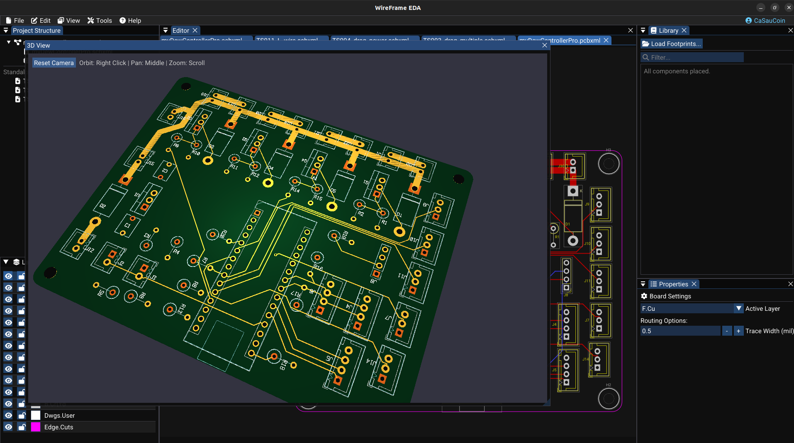

# 3D Viewer

The 3D Viewer renders a three-dimensional representation of your PCB — showing component placement, board geometry, and spatial relationships — so you can validate your design before manufacturing.

---

## Opening the 3D Viewer

From an open PCB document:

1. Go to **View → 3D Viewer…**
2. The 3D viewer opens as a separate window
3. It renders:
    - The **board** as a 3D extruded shape derived from the Edge.Cuts outline
    - **Footprints** with 3D models (STEP/OBJ) if available
    - **Simple colored boxes** for footprints without 3D models

---

## Camera Controls

| Action | Input | Effect |
|---|---|---|
| **Orbit** | Left or right mouse button drag | Rotate the camera around the board |
| **Pan** | Middle mouse button drag | Move the camera parallel to the screen |
| **Zoom** | Mouse scroll wheel | Zoom in / out |

---

## How Components Are Rendered

### With a 3D model (STEP / OBJ)

- The actual 3D mesh from the STEP or OBJ file is rendered
- Colors and materials come from the model file

### Without a 3D model

- A simple **colored bounding box** approximating the footprint size is drawn
- Color is determined by the designator prefix:

| Prefix | Color | Component type |
|---|---|---|
| R | Beige/brown | Resistor |
| C | Yellow | Capacitor |
| U | Dark grey | IC |
| J, P | Light grey | Connector |
| D | Green | Diode |
| Q | Black | Transistor |

---

## Bottom-Side Components

Footprints flipped to **B.Cu** are rendered on the underside of the board with the same orientation shown in the 2D editor.

Use the underside camera view to confirm that flipped models, silkscreen, pad plating, and board clearances match the 2D layout.

---

## Practical Use Cases

| Use case | How |
|---|---|
| **Verify component placement** | Orbit around the board, zoom into areas of interest |
| **Check physical clearances** | Zoom into tall components (connectors, relays) to check they don't interfere |
| **Inspect bottom-side components** | Orbit below the board to view B.Cu placement |
| **Capture for documentation** | Position the view, take a screenshot |

!!! tip "STEP files load slowly the first time"
    First-time loading of STEP files may take several seconds due to mesh tessellation and GPU upload. Subsequent frames use the cached mesh and are fast.

---

## Assigning 3D Models to Footprints

To display an accurate 3D model instead of a colored box, assign a STEP or OBJ file to the footprint:

1. Open the footprint in the **Footprint Wizard / Library Editor**
2. In the **3D Model** section, add the path to a STEP or OBJ file
3. Use the **Model Alignment Dialog** to fine-tune offset, scale, and rotation

See: [Footprint Libraries — 3D Model Alignment](../libraries/footprints-library.md)

---

## See Also

- [PCB Editor](../pcb/index.md) — the 2D PCB workspace
- [Fabrication & Export](../pcb/fabrication-and-export.md) — export after 3D verification
