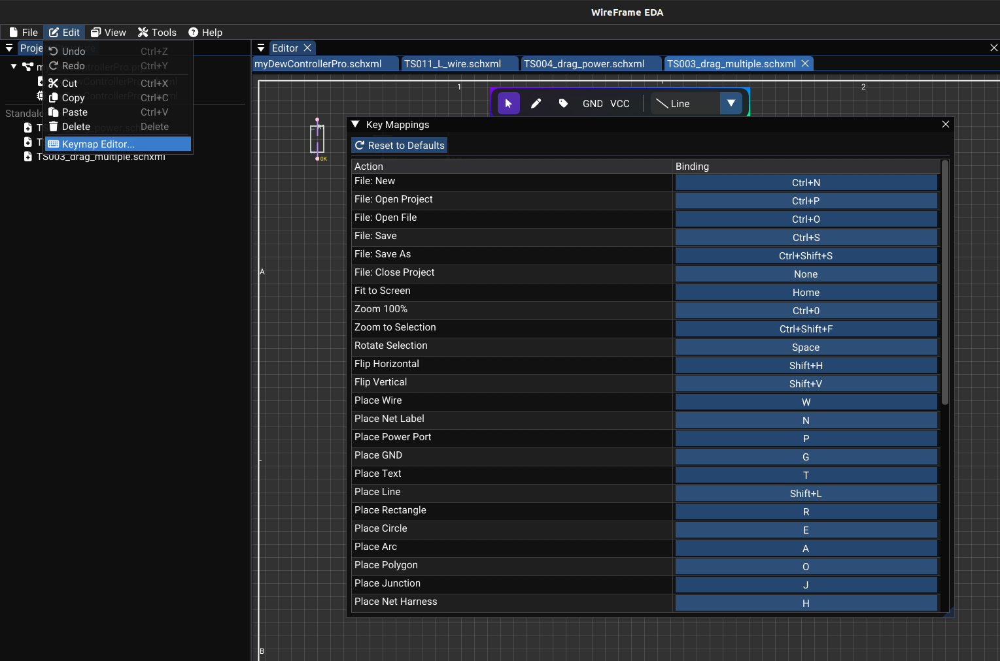

# Keyboard Shortcuts and Key Map

WireFrame uses a fully customizable key map managed by the key map system. Every action can be rebound to your preferred shortcut.

---

## Key Map Editor

Accessible from **Edit → Keymap…** in the main menu:

1. A list of all actions is displayed with:
    - **Action name** (e.g., "Place Wire", "Rotate", "Undo").
    - **Current binding** (e.g., `W`, `R`, `Ctrl+Z`).
2. Click a binding cell to start **recording** a new shortcut.
3. Press the desired key combination (e.g., ++ctrl+r++).
4. The binding updates immediately.
5. Press ++esc++ to cancel recording.

Bindings are stored in memory and can be persisted in future versions via the config file.

<!-- TODO: Replace with actual screenshot
     Capture the Keymap Editor dialog:
     - _A table with two columns: **Action** and **Shortcut**._
     - _10–15 actions visible (e.g., "Place Wire: W", "Rotate: R", "Undo: Ctrl+Z", "Delete: Delete")._
     - _One row in "recording" state — the shortcut cell showing "Press a key…" or highlighted in cyan._
     - _A scrollbar on the right if the list is long._
     Suggested size: 500×400px.
-->

---

## Default Shortcuts — Global

| Action | Default shortcut | Description |
|---|---|---|
| New Schematic / PCB | ++ctrl+n++ | Create a new document |
| Open File | ++ctrl+o++ | Open a file dialog |
| Save | ++ctrl+s++ | Save the active document |
| Save As | ++ctrl+shift+s++ | Save with a new filename |
| Undo | ++ctrl+z++ | Undo last action |
| Redo | ++ctrl+y++ | Redo last undone action |
| Copy | ++ctrl+c++ | Copy selected items |
| Cut | ++ctrl+x++ | Cut selected items |
| Paste | ++ctrl+v++ | Paste from clipboard |
| Delete | ++delete++ | Delete selected items |
| Select All | ++ctrl+a++ | Select all items on canvas |

---

## Default Shortcuts — Navigation

| Action | Default shortcut | Description |
|---|---|---|
| Fit to Screen | ++f++ | Zoom to fit all content |
| Zoom 100% | ++1++ | Reset zoom to 100% |
| Zoom to Selection | ++shift+f++ | Zoom to fit selected items |

---

## Default Shortcuts — Schematic

| Action | Default shortcut | Description |
|---|---|---|
| Place Wire | ++w++ | Activate wire drawing mode |
| Place Net Label | ++l++ | Activate label placement mode |
| Place GND | ++g++ | Place a GND power symbol |
| Place Text | ++t++ | Activate text placement mode |
| Rotate | ++r++ | Rotate selected component(s) |
| End Wire | ++esc++ | End current wire drawing |

---

## Default Shortcuts — PCB

| Action | Default shortcut | Description |
|---|---|---|
| Route Trace | ++x++ | Activate trace routing mode |
| Place Via | ++v++ | Place a via (or switch layer during routing) |
| Move | ++m++ | Move selected items |
| Flip | ++f++ | Flip selected footprint(s) front ↔ back |
| Rotate | ++r++ | Rotate selected items 90° |

---

## Default Shortcuts — Alignment

| Action | Default shortcut | Description |
|---|---|---|
| Align Horizontal | (configurable) | Align selected text attributes horizontally |
| Align Vertical | (configurable) | Align selected text attributes vertically |

---

## Default Shortcuts — Simulation

| Action | Default shortcut | Description |
|---|---|---|
| Run Simulation | (configurable) | Execute the current simulation configuration |
| Abort Simulation | (configurable) | Halt a running simulation |
| Toggle Cursors | (configurable) | Show/hide measurement cursors in the waveform viewer |

---

## Customization Tips

!!! tip "Match your workflow"
    If you're coming from another EDA tool (KiCad, Altium, Eagle), you can rebind WireFrame's shortcuts to match. Open **Edit → Keymap…** and set your preferred bindings.

!!! info "Conflict detection"
    If you assign a shortcut that's already used by another action, the editor will notify you and remove the old binding.

---

## See Also

- [Selection & Editing](selection-and-editing.md) — keyboard operations for selection and clipboard.
- [Schematic Editor](../schematic/index.md) — schematic-specific tool modes.
- [PCB Editor](../pcb/index.md) — PCB-specific tool modes.
