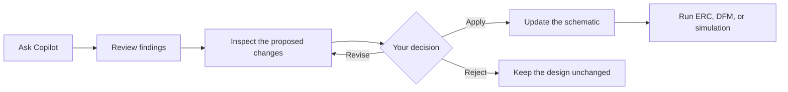

# AI Copilot

Use Copilot to review a design, investigate a circuit block, prepare schematic changes, and explain simulation results. Copilot shows proposed changes for your review before they are applied.

## Review before applying

## Ask a focused question

1. Open your project and the relevant schematic.
2. Open the **Copilot** panel.
3. Describe the circuit section and what you want checked.
4. Review the components, nets, and warnings mentioned in the response.
5. If changes are proposed, inspect the preview before selecting **Apply**.
6. Verify accepted changes with ERC, DFM, or simulation.

Good questions are specific:

- “Review the 3.3 V regulator for missing protection and decoupling.”
- “Check whether the USB connector pins and protection parts are connected correctly.”
- “Explain why `VOUT` fails its ripple check after startup.”

## Work with circuit blocks

Copilot can group related parts into circuit blocks such as power, protection, connector, oscillator, or logic sections. Use these blocks to focus a review or simulation on one part of a large schematic.

When a proposed block can be placed on the canvas:

1. Review the parts and connections in the block card.
2. Drag the card to the schematic.
3. Check the placement and wire preview.
4. Place the block.
5. Review every connection before continuing.

## Create a symbol or footprint from a datasheet

Attach the component's PDF datasheet when its pins, package, or simulation model are not already available.

Before accepting the generated library item, verify:

- manufacturer and exact part number;
- package name and pin count;
- pin numbers, names, and electrical types;
- footprint pitch, pad dimensions, drill sizes, and orientation;
- the assigned simulation model, when required.

Use the preview and review screen to correct any extracted value before saving or placing the part.

!!! warning
    Always compare generated library data with the manufacturer's recommended land pattern and pin table. A visually correct symbol does not guarantee a correct footprint or pin mapping.

## Ask about a simulation result

Open the Simulation Workbench **AI** tab or select **Ask why** beside a failed testbench check.

Include the signal and expected behavior in your question. For example:

> Explain why `VOUT` fails the ripple limit after settling. Use the current testbench and measurement.

Copilot can help interpret the result, but it does not decide the acceptable limit. Enter limits from your product requirement or datasheet in the testbench.

## Use Copilot safely

- Review every proposed edit before applying it.
- Check component ratings and pin mappings against the datasheet.
- Run the appropriate verification after each accepted change.
- Ask about one sheet, block, component, or signal at a time.
- Treat Copilot's response as design assistance, not final approval.
