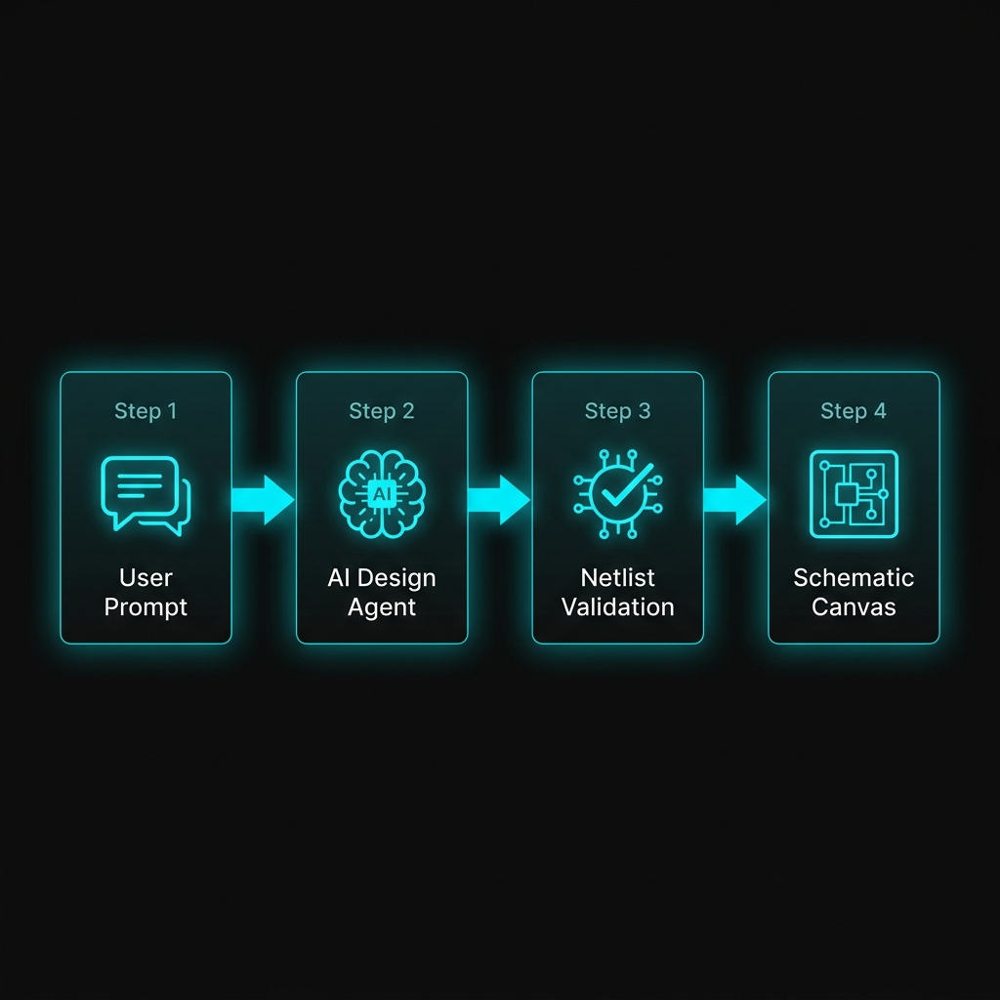

# AI Copilot — Overview

WireFrame includes a built-in **AI Copilot** — a conversational design assistant that can generate complete electronic circuits from plain-text descriptions. It handles component selection, netlist generation, simulation verification, automatic placement, and routing — all from within the editor.

---

## What the AI Copilot Can Do

| Capability | Description |
|---|---|
| **Design from text** | Describe a circuit in plain English → AI generates a complete schematic |
| **Component selection** | AI researches and selects real components with correct pin assignments |
| **Netlist generation** | Produces a wiring netlist matching physical datasheets |
| **Library verification** | Checks generated components against your local library pool |
| **SPICE verification** | Automatically simulates the design and validates waveforms |
| **Auto-placement** | Places components on the schematic with logical grouping |
| **Auto-routing** | Routes PCB traces using A* pathfinding |
| **Component generation** | If a component is missing from the library, AI creates the symbol and footprint |
| **Iterative refinement** | Refine the design through follow-up conversation |

---

## Architecture

```
┌──────────────────────────────────────────────────────────────────────┐
│                        WireFrame Editor (C++)                        │
│                                                                      │
│   ┌──────────────┐    ┌──────────────┐    ┌──────────────────────┐  │
│   │ AI Copilot   │───▶│ AI Manager   │───▶│ LLM API (HTTP)       │  │
│   │ Panel (Chat) │    │ (HTTP Bridge)│    │ (OpenRouter / Gemini) │  │
│   └──────────────┘    └──────────────┘    └──────────────────────┘  │
│         │                                                            │
│         ▼                                                            │
│   ┌──────────────┐    ┌──────────────┐    ┌──────────────────────┐  │
│   │ Design Agent │───▶│ Library      │───▶│ Simulation           │  │
│   │ (BOM+Netlist)│    │ Reviewer     │    │ Verifier             │  │
│   └──────────────┘    └──────────────┘    └──────────────────────┘  │
│         │                                                            │
│         ▼                                                            │
│   ┌──────────────┐    ┌──────────────┐                              │
│   │ Auto-Placer  │───▶│ Auto-Router  │                              │
│   │ (Clustering) │    │ (A* Grid)    │                              │
│   └──────────────┘    └──────────────┘                              │
└──────────────────────────────────────────────────────────────────────┘
```

- **AI Copilot Panel**: The chat interface where you interact with the agent.
- **AI Manager**: HTTP bridge to LLM providers (OpenRouter, Gemini, etc.).
- **Design Agent**: Autonomous planner that generates BOM and netlist JSON.
- **Library Reviewer**: Checks generated components against your local library.
- **Simulation Verifier**: Runs SPICE simulation to validate the design.
- **Auto-Placer / Auto-Router**: Handles physical placement and trace routing.

---

## Getting Started

### 1. Configure API Key

The AI Copilot requires an API key for LLM access:

1. Open the AI Copilot Panel (**View → AI Copilot** or the sidebar icon).
2. Click the **Account/Settings** icon (⚙) in the panel header.
3. Enter your **OpenRouter API key**.
4. Click **Save**.

!!! info "API key providers"
    WireFrame uses [OpenRouter](https://openrouter.ai/) as the default LLM gateway, which provides access to multiple AI models (Gemini, Claude, GPT, etc.). You can obtain a free API key from their website.

### 2. Open the AI Copilot Panel

The AI Copilot appears as a **dockable panel** in the editor. It features:

- A **chat input** at the bottom for typing prompts.
- A **message history** showing the conversation.
- **Progress bars** for background tasks (simulation, routing).
- **Action buttons** for review, placement, and routing steps.

<!-- TODO: Replace with actual screenshot
     SCENARIO: Capture the AI Copilot Panel in its default state:
     - Chat history area showing a welcome message.
     - An input field at the bottom with placeholder "Type your circuit request..."
     - The panel docked on the left or right side of the editor.
     - A small settings/account icon in the header.
     - Dark theme matching the editor.
     SUGGESTED SIZE: 350×600px (panel only) or 1280×720px (full window with panel visible)
-->
[//]: # ()

---

## AI Design Workflow

The complete AI-assisted design flow:



1. **Prompt** — Describe what you want in plain text.
2. **Research** — AI analyzes your request, researches components and datasheets.
3. **Clarify** — AI asks follow-up questions if requirements are ambiguous.
4. **Design** — AI generates the complete BOM and netlist.
5. **Review** — You review and approve the generated design.
6. **Verify** — AI runs SPICE simulation to validate the design.
7. **Place** — Auto-placer positions components on the schematic/PCB.
8. **Route** — Auto-router connects all traces on the PCB.
9. **Export** — Generate Gerber and BOM files.

---

## Session Management

The AI Copilot supports **multiple conversation sessions**:

- Click **New Session** to start a fresh design conversation.
- Previous sessions are saved and can be reopened from the **History Sidebar**.
- Each session tracks its own design state, BOM, netlist, and simulation results.
- Sessions are persisted per-project — reopening the project restores the AI conversations.

---

## Section Pages

| Page | What you'll learn |
|---|---|
| [AI Design Agent](design-agent.md) | Research → clarify → design workflow in detail |
| [Auto-Placer & Auto-Router](auto-placer-router.md) | Physical placement and routing algorithms |
| [AI Component Generator](component-generator.md) | Automatic symbol/footprint generation from datasheets |

---

## See Also

- [Tutorial: AI-Assisted Design](../tutorial/ai-design.md) — hands-on AI design walkthrough.
- [Simulation](../simulation/index.md) — AI uses simulation for design verification.
- [Libraries](../libraries/symbols-library.md) — AI checks components against loaded libraries.
