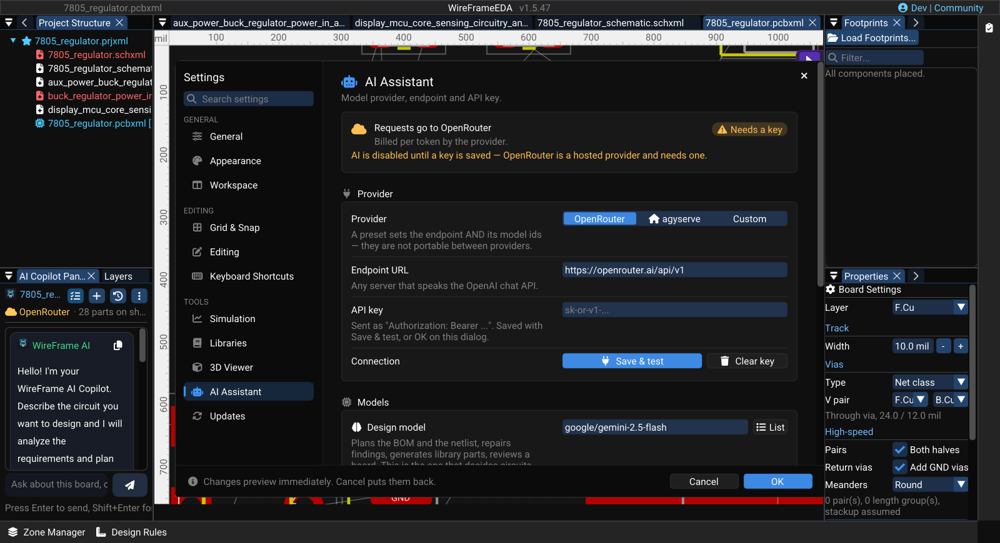

# AI Copilot

AI Copilot helps turn a circuit request into a reviewable design, inspect an existing schematic or PCB, organize functional blocks, generate missing library items, and explain simulation results. It assists the workflow; it does not replace datasheet review, ERC, DRC, DFM, or engineering approval.

## Configure AI access

1. Open **Preferences → AI**, or open the Copilot menu and select **AI settings**.
2. Enter your OpenRouter API key.
3. Select an allowed model.
4. Save the settings.
5. Open **View → AI Copilot Chat**.

The current release uses a locally configured, user-provided OpenRouter key. Do not place that key in screenshots, project files, bug reports, or shared configuration examples.

### Image — AI settings

!!! note "Image capture brief"
    1. **Prepare:** Open a clean release-build workspace with fictional or public sample data and prepare the requested state.
    2. **Build the frame:** Capture the current AI provider settings with the key value hidden. Show the provider/model controls and save action. Do not use the older screenshot placeholder that shows a different header or input text. Suggested size: **900 × 620 px**.
    3. **Clean the frame:** Close unrelated panels and tooltips, move the pointer away from key text, and hide credentials, usernames, customer data, and private paths.
    4. **Capture and finish:** Capture a native-resolution PNG, crop without cutting titles or primary actions, and add at most three subtle callouts without altering engineering content.
    5. **Approve:** Check the image at 100% zoom for current labels, readable evidence, correct release branding, and absence of sensitive information.

<!-- wf:shot id=ai-settings
caption: Settings → AI Assistant — provider, endpoint, key and models
setup:
- open_project
- wait: 1
- menu:
  - Preferences
  - Preferences...
- wait: 1
- click_at:
  - 377
  - 626
- wait: 1
- action:
    action: mouse_move_to
    x: 1000
    y: 12
brief_sha256: 770e674e0ce469d2
-->
<!-- wf:out id=ai-settings sha=c6ef29069f27 -->

<!-- /wf:out -->

## Start a focused session

Use the **+** control to create a session and the history control to reopen earlier project sessions. Describe one goal at a time and include measurable requirements where possible.

Good starting requests include:

- “Design a 12 V to 5 V buck supply for a 1 A load.”
- “Review the USB-C power input and protection block on this schematic.”
- “Explain the failed `VOUT` ripple assertion from the latest simulation.”
- “Group this sheet into power, control, and interface blocks.”

Long sessions are summarized and relevant project facts can be recalled later. Still restate safety-critical values before asking Copilot to modify or verify a design.

### Short video — Start and reopen a Copilot session

!!! note "Video production brief"
    1. **Prepare:** Open a fictional sample project and prewrite a short non-sensitive prompt for pasting.
    2. **Opening shot (1–2 s):** Start on the workspace with the **View** menu closed.
    3. **Action shot (6–9 s):** Open **View → AI Copilot Chat**, create a session, paste and submit the request, then open **History** and select the same session.
    4. **Result shot (2–3 s):** Hold on the reopened conversation with its session identity and request visible.
    5. **Deliver:** Export a **10–15 second** 1080p MP4; remove waiting time and reveal no API key or private project data.

<!-- wf:video id=start-and-reopen-a-copilot-session
caption: Start a new session with +, then reopen the NE555 design session from History
project: none
setup:
- pick_folder: tutorials
- menu:
  - File
  - New
  - New Project (.prjxml)...
- wait: 1
- type:
    text: NE555 Blinker
- click_at:
  - 634
  - 485
- wait: 2
- menu:
  - File
  - New
  - New Schematic (.schxml)
- wait: 1
- save_file: tutorials/NE555 Blinker.schxml
- keys:
  - Ctrl
  - S
- wait: 2
- panel: ai
- wait: 1
- type:
    ref: //AI Copilot Panel/##ChatInput
    text: Design a 9 V NE555 astable LED blinker. Target 1 Hz, use a red LED, include current limiting
      and supply decoupling, and identify every assumption that needs my confirmation.
- keys:
  - Enter
- wait_for:
    ref: //AI Copilot Panel/Use all suggestions & continue
    timeout: 580
    scroll_in: //AI Copilot Panel
- action:
    action: mouse_move_to
    x: 1000
    y: 12
steps:
- wait: 1
- click: //AI Copilot Panel/{fa:plus}
- wait: 1.5
- click: //AI Copilot Panel/{fa:history}
- wait: 1.5
- click_at:
  - 140
  - 615
- wait: 3
brief_sha256: 78ff13376c9526fa
-->
<!-- wf:out id=start-and-reopen-a-copilot-session sha=63a468b7e772 -->
<video controls muted playsinline preload="metadata" src="../assets/wf/docs/ai/index/start-and-reopen-a-copilot-session.mp4" title="Start a new session with +, then reopen the NE555 design session from History"></video>
<!-- /wf:out -->

## Design workflow

### Diagram — AI design review workflow

!!! note "Diagram production brief"
    1. **Prepare:** Copy the exact workflow stages and review gates from this page into a vector design file.
    2. **Build the content:** Create a polished release diagram showing: requirement and constraints → clarification → component and connection review → missing-item generation when needed → deterministic verification → user-approved apply. The older four-step image omitted review and simulation gates and must not be reused.
    3. **Compose:** Arrange the stages left to right, use one consistent shape system, and make review or correction loops visually distinct.
    4. **Finish:** Verify every label manually; do not use ASCII art, a Mermaid screenshot, or AI-generated text inside the graphic.
    5. **Deliver and approve:** Export SVG plus a 2× PNG fallback, then confirm readability at the documentation embed width.

1. Describe the circuit and constraints.
2. Review the research summary.
3. Answer the clarifying questions, or select **Use all suggestions & continue** only when the suggested answers are acceptable.
4. Review BOM components, connections, and functional blocks.
5. Resolve missing symbols, footprints, and pin-count mismatches.
6. Run **Netlist Check**, simulation, and design analysis.
7. Add approved blocks or create the AI project.
8. Inspect the schematic before updating a PCB.

## Component Review tabs

| Tab | Use it for |
|---|---|
| **BOM Components** | Check part number, value, package, origin, and library status |
| **Connections Netlist** | Review named connections and pin references |
| **Blocks** | Generate and review functional circuit groups |
| **Local Pool Settings** | Add library sources and review generated contracts |
| **Simulate & Verify** | Run simulation checks for the proposed design |
| **Design Analysis** | Review design-level findings |
| **Netlist Check** | Find pin, connectivity, and consistency problems |

### Image — Current Component Review tabs

!!! note "Image capture brief"
    1. **Prepare:** Open a clean release-build workspace with fictional or public sample data and prepare the requested state.
    2. **Build the frame:** Capture the full Component Review tab row from the current build, with **BOM Components** selected and at least one component card visible. This replaces older media showing only BOM, Netlist, and Placement Preview. Suggested size: **1400 × 820 px**.
    3. **Clean the frame:** Close unrelated panels and tooltips, move the pointer away from key text, and hide credentials, usernames, customer data, and private paths.
    4. **Capture and finish:** Capture a native-resolution PNG, crop without cutting titles or primary actions, and add at most three subtle callouts without altering engineering content.
    5. **Approve:** Check the image at 100% zoom for current labels, readable evidence, correct release branding, and absence of sensitive information.

<!-- wf:shot id=current-component-review-tabs
caption: 'The review window: status chips, the tabs, and BOM Components selected'
project: samples/ne555-blinker/NE555 Blinker.prjxml
setup:
- open_project
- panel: ai
- wait: 2
- click: //AI Copilot Panel/{fa:tasks}
- wait: 2
- action:
    action: mouse_move_to
    x: 1000
    y: 12
brief_sha256: cf3dd64d95d11c33
-->
<!-- wf:out id=current-component-review-tabs sha=13e76425677a -->

<!-- /wf:out -->

## Safety and privacy

- AI requests and attached datasheet content are sent to the configured provider.
- Review every proposed change before applying it.
- Treat generated symbols and footprints as unverified until checked against the datasheet.
- Limit each request to the relevant sheet, block, or signal.
- Re-run deterministic checks after every accepted change.
- Stop and review when part numbers, package variants, ratings, or pinouts are ambiguous.

## Continue learning

- [AI Design Agent](design-agent.md)
- [AI Component Generator](component-generator.md)
- [Placement and Routing Assistant](auto-placer-router.md)
- [Review and Simulation Guide](../ai-copilot.md)
- [AI-Assisted Design Tutorial](../tutorial/ai-design.md)
