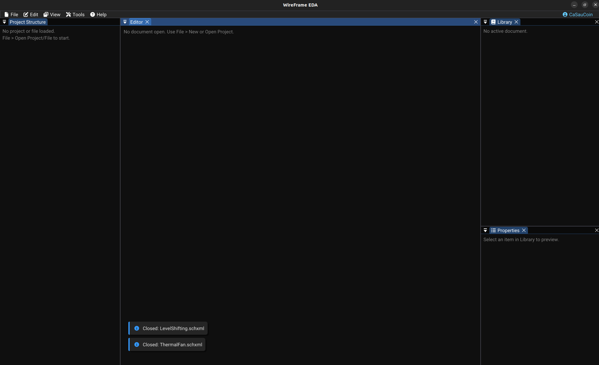
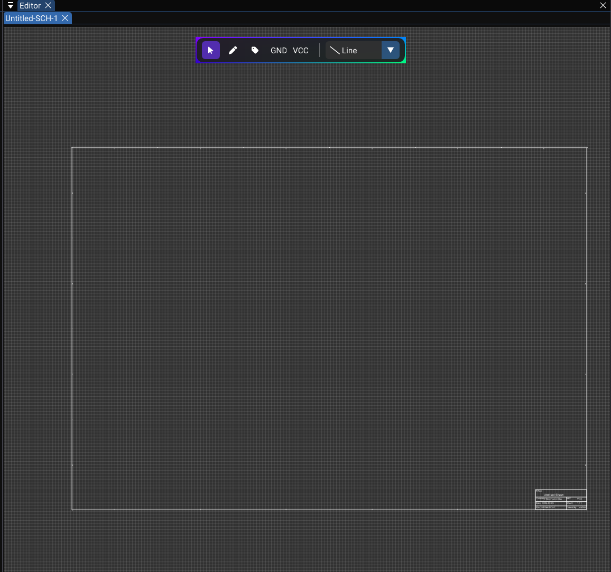
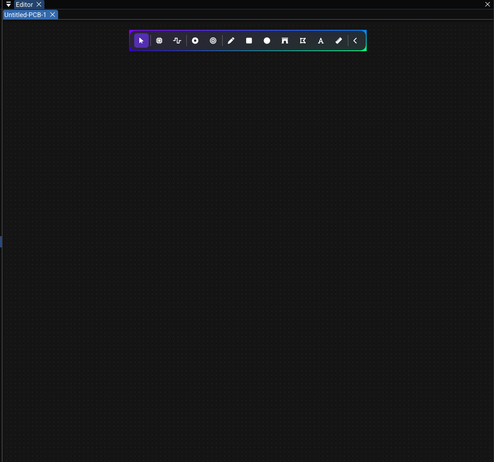

# Getting Started

This guide walks you through your first session with WireFrame EDA in approximately **10 minutes**.  
You will learn how to launch the application, understand the main interface, and set up your first project.

!!! abstract "What you'll learn"
    - Launching WireFrame
    - Understanding the main UI areas
    - Creating a new project
    - Adding schematic and PCB files
    - Opening existing projects and files

---

## 1. Launching WireFrame

=== "Linux"

    Run from terminal:
    ```bash
    ./wireframe
    ```
    Or search for **WireFrame** in your application menu.

=== "Windows"

    Open **Start Menu** → type **WireFrame** → press ++enter++.

=== "macOS"

    Open **Launchpad** → find **WireFrame** → click to launch.

On startup, WireFrame automatically **restores any open projects and documents** from your previous session.

> A brief dark flash is normal — the interface loads on the next render frame.

---

## 2. The Main Interface

After launching, you will see the following layout:



| Area | Default position | Purpose |
|---|---|---|
| **Menu bar** | Top | Access all features via menus |
| **Project Structure** | Left | Project file tree |
| **Canvas (Editor)** | Center | Design area — schematic or PCB |
| **Library** | Right (top) | Component / footprint list |
| **Properties** | Right (bottom) | Edit properties of the selected object |
| **Layer** *(PCB only)* | Right (middle) | Toggle and select PCB layers |
| **Logger** | Bottom overlay | Errors, warnings, and status messages |

!!! tip "Rearranging panels"
    **Drag any panel tab** to a different edge or corner to reposition it. Your layout is saved automatically and restored on next launch.

---

## 3. Creating a New Project

!!! important "Why use a project?"
    A **project** (`.prjxml`) is a central hub for all your files — schematics, PCBs, and libraries. Working inside a project makes file management easier and enables one-click Gerber export.

**Steps:**

1. Go to **File → New → New Project (.prjxml)**
2. Choose a folder and enter a filename, for example: `MyBoard.prjxml`
3. Click **Create** (or **Save**)

WireFrame automatically creates:

- `MyBoard.prjxml` — stores references to all schematics and PCBs
- A `lib/` folder for local libraries

The **Project Structure** panel immediately shows your new project with empty **Schematics** and **PCBs** groups.

---

## 4. Adding a Schematic File

1. Go to **File → New** and choose a new schematic
2. A new tab opens in the editor: `Untitled-SCH-1`
3. The canvas shows:
    - A dot grid on a dark background
    - An A4 page outline
    - The floating schematic toolbar at the top

Press **Ctrl+S** to save → name the file `.schxml`, for example: `main.schxml`

The schematic canvas looks like this:



---

## 5. Adding a PCB File

1. Go to **File → New** and choose a new PCB
2. A new tab opens: `Untitled-PCB-1`
3. The canvas shows a grid and the PCB floating toolbar

!!! tip "Convert from schematic instead"
    Rather than creating a PCB manually, complete your schematic first and use **Tools → Update Schematic to PCB**. Review the target board, imported footprints, and ratsnest before routing.

The PCB canvas looks like this:



---

## 6. Opening an Existing Project or File

### Opening a project (`.prjxml`)

1. **File → Open Project (.prjxml)**
2. Select the `.prjxml` file
3. The **Project Structure** panel populates with all linked schematics and PCBs
4. Click any entry to open it in the editor

### Opening a standalone file

1. **File → Open File** (or ++ctrl+o++)
2. Select a `.schxml` (schematic) or `.pcbxml` (PCB) file
3. The file opens as a tab in the editor — no project required

---

## Next Steps

You now know the basics. Continue with:

| Next page | Content |
|---|---|
| [UI Overview](ui-overview.md) | Detailed guide to every panel and toolbar |
| [Schematic Editor](schematic/index.md) | Place components, draw wires, manage nets |
| [PCB Editor](pcb/index.md) | Lay out footprints, route traces, export Gerbers |
| [Full Tutorial](tutorial/index.md) | End-to-end walkthrough: a complete LED circuit |
