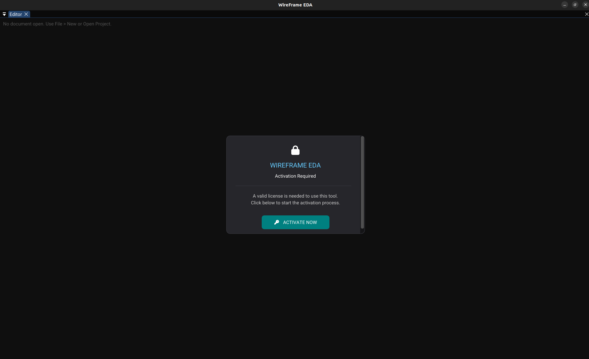

# Getting Started

This page walks you through your first session with WireFrame EDA:

1. Launching WireFrame.
2. Understanding the main layout.
3. Creating your first project.
4. Creating schematic and PCB files.
5. Opening existing files.

!!! abstract "Time estimate"
    Following this guide takes approximately **10 minutes**. By the end, you'll have an empty project ready for schematic design.

<!-- TODO: Replace with actual screenshot
     Capture a full-window screenshot of WireFrame immediately after launching (post-activation). The screenshot should clearly show:
     - _**Menu bar** at the very top with all menus visible (File, Edit, View, Project, Tools, Help)._
     - _**Project Structure** panel on the left side — either empty or showing "No project open"._
     - _**Central editor area** — empty docking space with a grey/dark background and grid pattern._
     - _**Library panel** on the right side — empty or showing "Load Symbols…" prompt._
     - _**Properties panel** below the library (or docked elsewhere) — showing "No selection"._
     Annotate the screenshot with numbered labels (1–5) pointing to each panel. Use arrows or colored boxes. Suggested size: 1280×720px.
-->

---

## Launching the Application

=== "Linux"

    Run: ./wireframe

    Or launch from your application menu by searching for "WireFrame".

=== "Windows"

    Open **Start Menu** → search for "WireFrame" → press ++enter++.

=== "macOS"

    Open **Launchpad** → find **WireFrame** → click to launch.

On startup, WireFrame:

1. Opens the main application window.
2. Sets up the docking layout with all panels.
3. Restores any previously open projects and documents from your last session (see [Config & Session](reference/config-and-session.md)).

If you see a blank dark window for a brief moment, that is normal — the interface loads on the next frame.

---

## Activation / Sign-In

If activation is required, a full-window overlay dialog appears:

1. Enter your **activation token** or **email + license key**.
2. Click **Activate** (or **Sign In**).
3. Wait for server confirmation — a spinner or progress message is shown.
4. Once activated, the overlay disappears and normal editing is enabled.

<!-- TODO: Replace with actual screenshot
     Capture the activation overlay dialog:
     - _Full-window overlay with a semi-transparent dark background blurring the main UI behind it._
     - _Centered dialog box containing: email input field, license key input field, an Activate button (cyan), and a status line._
     - _If possible, show the "Activation successful" state as a second screenshot._
     Suggested size: 800×500px.
-->

!!! tip "Resetting activation"
    You can change or reset activation data by removing the user config file. See [Config & Session](reference/config-and-session.md) for the file location on each OS.

---

## Main Layout Concepts

WireFrame uses **ImGui docking**, meaning panels can be freely rearranged by dragging tabs.

### Panel overview

| Panel | Location (default) | Purpose |
|---|---|---|
| **Menu bar** | Top | File, Edit, View, Project, Tools, Help |
| **Project Structure** | Left | Browse projects, schematics and PCBs |
| **Editor** | Center | Tabbed area for open documents (schematic/PCB canvases) |
| **Library** | Right | Lists symbols (schematic) or footprints (PCB) |
| **Properties** | Right (below Library) | Edit properties of selected objects |
| **Layer** (PCB only) | Right or bottom | Toggle and select PCB layers |
| **Logger** | Overlay (bottom) | Transient notifications (info, warnings, errors) |

### Rearranging panels

- **Drag a panel tab** to any edge or corner to dock it in a new position.
- **Float a panel** by dragging it outside the docking area.
- Layout is automatically saved via ImGui configuration and restored on next launch.

<!-- TODO: Replace with actual video
     Record a 15–20 second screen capture showing:
     1. _The user grabbing the Library panel tab and dragging it to the bottom of the window._
     2. _A blue docking preview rectangle appearing to show where the panel will land._
     3. _Releasing the mouse — the Library panel is now docked at the bottom._
     4. _Dragging it back to the right side to restore the default layout._
     Keep mouse movements slow and deliberate. Resolution: 1280×720 at 30fps.
-->

[//]: # (<video controls width="100%">)

[//]: # (  <source src="../img/getting-started/panel-rearrange.webm" type="video/webm">)

[//]: # (  <source src="../img/getting-started/panel-rearrange.mp4" type="video/mp4">)

[//]: # (  Your browser does not support the video tag.)

[//]: # (</video>)

---

## Creating a New Project

1. Open **File → New Project…** from the menu bar.
2. In the dialog, choose a location and filename for the `.prjxml` file:
    - Example: `~/Documents/MyBoard/MyBoard.prjxml`
3. Click **Create** (or **Save**).

WireFrame creates:

- The `.prjxml` project file containing:
    - List of linked schematics.
    - List of linked PCBs.
    - Library folder reference (default: `lib/`).
- A project root folder (if it doesn't already exist).

The **Project Structure** panel immediately shows the new project as a root node.

<!-- TODO: Replace with actual screenshot
     Capture the "New Project" file dialog:
     - _A file-save dialog (native OS or ImGui) showing the file browser._
     - _The filename field populated with a sample name like `MyBoard.prjxml`._
     - _The "Save" or "Create" button highlighted._
     Then capture a second screenshot showing the Project Structure panel with the newly created project node (expanded but empty — no schematics or PCBs yet). Suggested size: 700×450px.
-->
<video controls width="100%">
  <source src="../img/projects/new-project-dialog.mp4" type="video/mp4">
  Your browser does not support the video tag.
</video>
)

!!! info "Project file details"
    For the full specification of `.prjxml` files, see [Projects & Files](projects.md) and [File Formats](reference/file-formats.md).

---

## Creating a New Schematic File

1. With a project open, go to **File → New Schematic**.
2. A new untitled schematic document appears as a tab in the editor:
    - Tab name: `Untitled-SCH-1`.
    - Document type: Schematic.
3. The central canvas shows:
    - A dot grid on a dark background.
    - The **schematic floating toolbar** (centered at top).
    - An A4 page outline (default paper size).

Save it via **File → Save** (++ctrl+s++) or **File → Save As…** to create a `.schxml` file.

<!-- TODO: Replace with actual screenshot
     Capture the editor with a freshly created empty schematic:
     - _The schematic tab visible at the top of the editor area, labeled "Untitled-SCH-1"._
     - _The canvas showing the dot grid and A4 page outline (dashed rectangle)._
     - _The **schematic toolbar** floating at the top-center with tool buttons: Select, Wire, Label, Text, Line, Rect, Circle, Arc, Polygon, Junction, GND, VCC._
     - _All tools deselected except "Select" (default mode)._
     - _The Library panel on the right showing "Load Symbols…" or an empty list._
     Suggested size: 1280×720px.
-->

---

## Creating a New PCB File

1. Go to **File → New PCB**.
2. A new PCB document tab appears:
    - Empty board area with a grid.
    - The **PCB floating toolbar** at the top of the canvas.
    - Default 2-layer stack (F.Cu, B.Cu) plus silkscreen, mask and edge layers.

You can later **convert** a schematic to a PCB to automatically populate footprints and netlist. See [PCB Editor](pcb/index.md) for details.

<!-- TODO: Replace with actual screenshot
     Capture the editor with a freshly created empty PCB:
     - _The PCB tab visible (labeled "Untitled-PCB-1")._
     - _The canvas showing the grid (no footprints, no board outline)._
     - _The **PCB toolbar** floating at top-center with tools: Select, Place Footprint, Route Trace, Draw Via, Place Hole, drawing tools, Measure._
     - _The **Layer panel** visible on the right showing F.Cu (active, highlighted), B.Cu, and other layers._
     Suggested size: 1280×720px.
-->

---

## Opening an Existing Project or File

### Opening a project (`.prjxml`)

1. **File → Open Project…**
2. Select a `.prjxml` file in the file browser.
3. WireFrame loads the project and populates the **Project Structure** panel:
    - All registered schematics appear under a "Schematics" node.
    - All registered PCBs appear under a "PCBs" node.
    - Library references are resolved.
4. Click any schematic or PCB entry in the tree to open it in the editor.

### Opening a single file

1. **File → Open…**
2. Select a `.schxml` (schematic) or `.pcbxml` (PCB) file.
3. The file opens as a document tab in the editor — even if it's not part of a project.

<!-- TODO: Replace with actual screenshot
     Capture the Project Structure panel after opening a sample project:
     - _The project node expanded (e.g., "MyBoard.prjxml")._
     - _Under it: a "Schematics" folder with 1–2 `.schxml` entries._
     - _A "PCBs" folder with 1 `.pcbxml` entry._
     - _One of the schematic files actively open in the editor (its tab visible in the center)._
     Suggested size: 300×400px (panel crop) or 1280×720px (full window).
-->

---

## Next Steps

You now know how to launch WireFrame, navigate the UI, and create projects and documents.

!!! success "Ready to design"
    Continue to the next pages to deepen your knowledge:

| Next page | What you'll learn |
|---|---|
| [UI Overview](ui-overview.md) | Detailed walkthrough of every panel, toolbar and menu |
| [Schematic Editor](schematic/index.md) | Place components, wire nets, add labels |
| [PCB Editor](pcb/index.md) | Layout footprints, route traces, export Gerbers |
| [Full Tutorial](tutorial/index.md) | Complete end-to-end project walkthrough |

