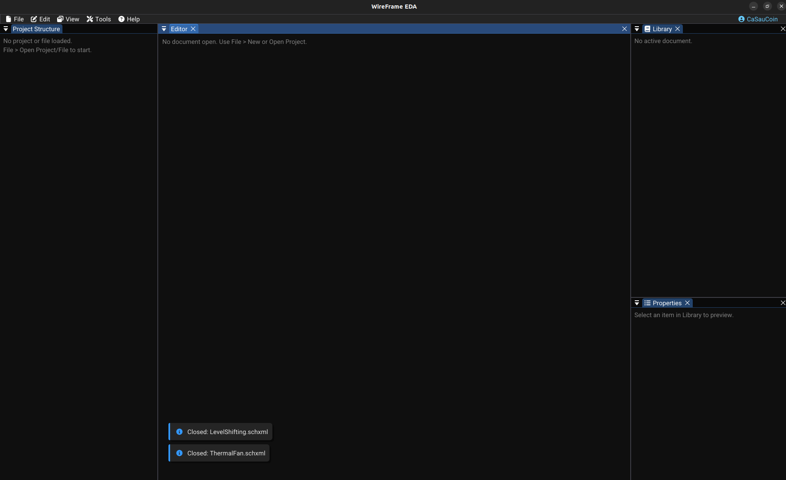

---
hide:
  - navigation
  - toc
---

<div class="wf-hero" markdown>

<span class="wf-badge">v1.3.7 — Stable Release</span>

# WireFrame EDA

<p class="wf-subtitle">
A lightweight, keyboard-driven EDA environment for schematic capture, PCB layout,<br>
3D visualization and manufacturing export — all in one desktop application.
</p>

<div class="wf-cta">
  <a href="getting-started/" class="primary">Get Started</a>
  <a href="tutorial/" class="secondary">Try the Tutorial →</a>
</div>

</div>

<!-- TODO: Replace with actual screenshot
     Capture the WireFrame main window immediately after launch. The screenshot should show:
     - _The **dark-themed window** with the menu bar at the top (File, Edit, View, Project, Tools, Help)._
     - _The **Project Structure** panel on the left side (empty or with a sample project open)._
     - _The **central editor area** showing either an empty docking space or a sample schematic/PCB tab._
     - _The **Library panel** on the right side._
     - _The cyan accent color visible on active UI elements._
     - _Window size: approximately 1920×1080 for best readability._
-->



---

## Key Features

<div class="wf-grid" markdown>

<div class="wf-card" markdown>

### :material-chip: Schematic Editor

Design circuits with a full-featured schematic editor — place symbols from KiCad-compatible libraries, wire nets, add labels and power symbols, and manage multi-sheet designs.

</div>

<div class="wf-card" markdown>

### :material-developer-board: PCB Layout

Route traces with 45° guidance, place vias and zones, manage multi-layer stacks, and run DFM/DRC checks before exporting Gerber files for fabrication.

</div>

<div class="wf-card" markdown>

### :material-library-shelves: Library Management

Load KiCad symbol (`.kicad_sym`) and footprint (`.kicad_mod`) libraries. Link footprints to symbols, generate custom footprints with the built-in wizard.

</div>

<div class="wf-card" markdown>

### :material-rotate-3d: 3D Viewer

Preview your PCB in 3D with imported STEP/OBJ models. Orbit, pan and zoom to verify component placement, clearances and board aesthetics before manufacturing.

</div>

<div class="wf-card" markdown>

### :material-keyboard: Keyboard-Driven

Fully customizable key map for every action — from placing wires to running DRC. Built for speed with an ImGui docking interface that keeps everything one keystroke away.

</div>

<div class="wf-card" markdown>

### :material-export: Fabrication Export

Export production-ready Gerber files, Excellon drill data, BOM spreadsheets and schematic PDFs. Verify outputs instantly with the built-in Gerber viewer.

</div>

<div class="wf-card" markdown>

### :material-swap-horizontal: Import & Compatibility

Import projects from KiCad, Altium Designer, and Eagle. Load symbol and footprint libraries from all major EDA formats — no manual conversion needed.

</div>

</div>

---

## Typical Workflow

```
┌───────────┐   ┌───────────┐   ┌────────────┐   ┌────────────┐   ┌──────────┐
│  Create    │──▶│  Design   │──▶│  Convert   │──▶│  Route &   │──▶│  Export   │
│  Project   │   │  Schematic│   │  to PCB    │   │  Verify    │   │  Gerbers  │
└───────────┘   └───────────┘   └────────────┘   └────────────┘   └──────────┘
```

1. **Create or open a project** — Organize schematics, PCBs and libraries under a single `.prjxml` project file.
2. **Design the schematic** — Place components, wire nets, add power symbols and labels, configure sheet properties.
3. **Convert to PCB** — Generate a PCB document from the schematic with footprints and netlist automatically linked.
4. **Route and verify** — Place footprints, route traces, add zones, then run DFM/DRC checks to catch errors.
5. **Export for fabrication** — Generate Gerber/drill files, export BOM and schematic PDFs, and preview in the Gerber viewer.

---

## Who Is This For?

| Audience | Why WireFrame? |
|---|---|
| **Electronics hobbyists** | Simple, focused tool — no bloated menus. Start designing in minutes. |
| **Students & educators** | Lightweight install, clear workflow from schematic to Gerber. |
| **Professional engineers** | Keyboard-driven speed, KiCad library compatibility, batch export. |
| **Open-source contributors** | C++17 codebase with ImGui — easy to extend and hack on. |

---

## Documentation Map

| Section | What You'll Learn |
|---|---|
| [Getting Started](getting-started.md) | Launch the app, understand the UI, create your first project |
| [Tutorial](tutorial/index.md) | Build a simple LED circuit from scratch in 15 minutes |
| [Schematic Design](schematic/index.md) | Place components, wire nets, manage properties |
| [PCB Layout](pcb/index.md) | Footprints, routing, zones, DRC and fabrication export |
| [Libraries](libraries/symbols-library.md) | Load, create and manage symbols and footprints |
| [Advanced Features](advanced/selection-and-editing.md) | Selection, 3D viewer, keyboard shortcuts |
| [Reference](reference/file-formats.md) | File formats, config, FAQ, changelog |

---

!!! tip "New to WireFrame?"
    Start with the [Getting Started](getting-started.md) guide for a quick orientation, or jump straight into the [Tutorial](tutorial/index.md) to design a simple LED circuit from scratch.
