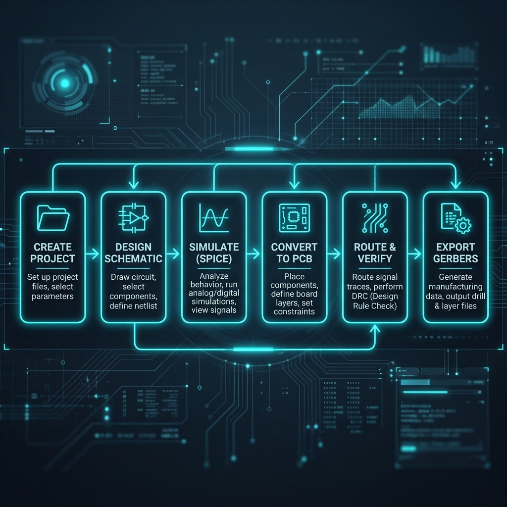

---
hide:
  - navigation
---

# WireFrame EDA

WireFrame is a desktop workflow for schematic design, PCB layout, circuit verification, library management, and fabrication output.

[Download WireFrame](https://wireframe.com.vn/download){ .md-button .md-button--primary }
[Open the website](https://wireframe.com.vn){ .md-button }

## Start here

1. [Install and activate WireFrame](installation.md).
2. [Create or open a project](getting-started.md).
3. Draw and check the [schematic](schematic/index.md).
4. Use the [Simulation Workbench](simulation/index.md) when the circuit has supported models.
5. Update the [PCB](pcb/index.md), place footprints, and route.
6. Run [DFM and DRC](pcb/dfm-and-drc.md).
7. Generate [fabrication outputs](pcb/fabrication-and-export.md).

## Current release focus

The v1.5.47 guideline covers:

- configurable simulation engines and SPICE model management;
- functional-block simulation scope;
- testbench loads, assertions, and measurements;
- waveform signal selection and A/B cursors;
- Simulation Copilot assistance;
- AI sessions, memory, functional blocks, and Component Review;
- AI Component Generator from templates or datasheets;
- Local Library Manager and supported Altium library conversion;
- asynchronous KiCad project import;
- release-ready fabrication, DRC, DFM, and 3D review.

## Choose a workflow

| Goal | Guideline |
|---|---|
| Learn the interface | [User Interface Overview](ui-overview.md) |
| Create and manage project files | [Projects and Files](projects.md) |
| Draw a schematic | [Schematic Editor](schematic/index.md) |
| Simulate and measure a circuit | [Simulation Workbench](simulation/index.md) |
| Design a PCB | [PCB Editor](pcb/index.md) |
| Add or convert libraries | [Library Import and Management](libraries/library-converter.md) |
| Generate a missing component | [AI Component Generator](ai/component-generator.md) |
| Ask Copilot to design or review | [AI Copilot](ai/index.md) |
| Prepare manufacturing files | [Fabrication and Export](pcb/fabrication-and-export.md) |

## Important review rule

!!! warning
    AI output, imported libraries, automatic placement, automatic routing, and simulation results all require review. Verify exact part numbers, pin mappings, package geometry, model assumptions, design rules, and fabrication output before release.

## Media status

Some pages intentionally show **Image needed**, **Video needed**, or **Image review needed** notes. These titles mark media that must be captured from the current release build; they replace fabricated ASCII diagrams and outdated UI mockups.
