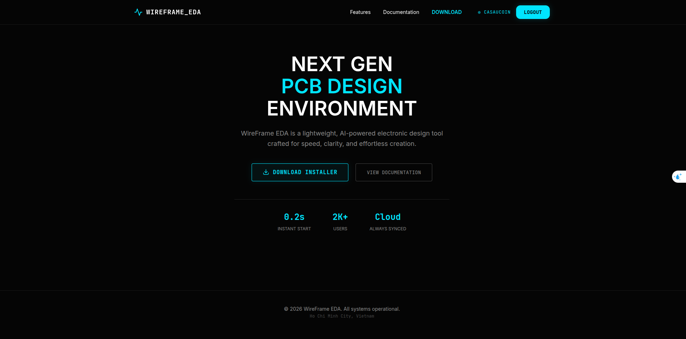
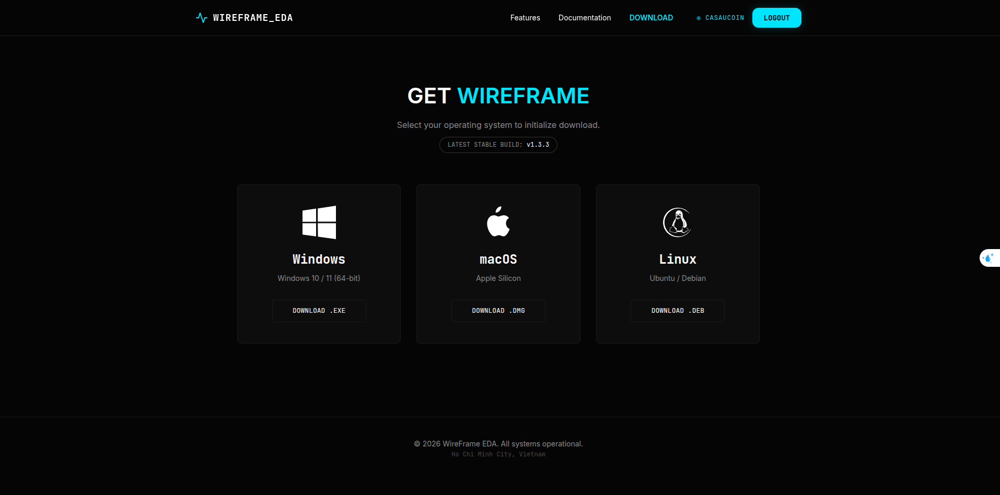

# Installation

This page explains how to **download, install, and launch** WireFrame EDA on all supported platforms.

| Platform | Package format | Architecture |
|---|---|---|
| **Windows** | Installer `.exe` | 64-bit (x86_64) |
| **macOS** | Disk image `.dmg` | Apple Silicon (arm64) |
| **Linux** | Debian package `.deb` | 64-bit (x86_64) |

!!! info "End-user guide"
    This page covers **pre-built packages** only. For building from source, see the developer documentation in the repository.

<!-- TODO: Replace with actual screenshot
     Create a simple infographic or flowchart showing the installation path:
     1. _Visit download page (browser window showing the release page)._
     2. _Download the installer for your OS (three icons: Windows logo, Apple logo, Linux penguin)._
     3. _Run the installer (progress bar)._
     4. _Launch and activate (WireFrame splash screen)._
     Use a clean, dark-themed graphic style consistent with the app. Suggested size: 800×200px.
-->



---

## 1. Downloading WireFrame

Go to the official download page:

:material-download: **Download:** `https://wireframe.com.vn/download`

On that page:

1. Choose the **latest stable version** (currently v1.3.7).
2. Select the package that matches your operating system and architecture.

<!-- TODO: Replace with actual screenshot
     Capture the download/release page in a web browser. The screenshot should show:
     - _A list of downloadable files grouped by OS (Windows `.exe`, macOS `.dmg`, Linux `.deb`)._
     - _The latest stable release version highlighted or pinned at the top._
     - _File sizes visible next to each download link._
     - _Browser address bar showing the URL._
-->



---

## 2. Windows Installation

### 2.1 Download the installer

1. On the download page, click the Windows installer link:
    - Example filename: `WireFrame-Setup-1.3.7-Windows-x64.exe`
2. Save the file to a convenient location (e.g., your `Downloads` folder).

### 2.2 Run the installer

1. Double-click the downloaded `.exe` file.
2. If Windows **SmartScreen** shows a warning:
    - Click **More info** → **Run anyway**.

    !!! warning "SmartScreen warning"
        This dialog appears because the installer may not yet be code-signed with an EV certificate. The software is safe to install if you downloaded it from the official source.

3. Follow the setup wizard:
    - **Accept** the license agreement.
    - **Choose** the installation folder (default `C:\Program Files\WireFrame\` is recommended).
    - **Optionally** create a desktop shortcut and Start Menu entry.
4. Click **Install** and wait for the process to finish.
5. Click **Finish** to close the installer.

<!-- TODO: Replace with actual screenshot
     Capture 2–3 key screens of the Windows installer wizard:
     - _Screen 1: License agreement page with the EULA text and "I accept" checkbox._
     - _Screen 2: Installation path selection showing the default folder and a Browse button._
     - _Screen 3: Installation progress bar or the final "Finish" screen._
     Each screenshot should be cropped to the installer window only (no desktop background). Suggested size: 600×450px each.
-->


### 2.3 Launch the application

Two ways to start WireFrame on Windows:

- **Start Menu**: Open Start → search for "WireFrame" → press ++enter++.
- **Desktop shortcut**: Double-click the WireFrame icon on your desktop.

---

## 3. macOS Installation

### 3.1 Download the disk image

1. On the download page, click the macOS link:
    - Example filename: `WireFrame-1.3.7-macOS.dmg`
2. Save the file (usually to `~/Downloads`).

### 3.2 Install the application

1. Double-click the downloaded `.dmg` to mount it.
2. A Finder window appears showing:
    - The **WireFrame** application icon.
    - A shortcut to the **Applications** folder.
3. **Drag** the WireFrame icon onto the Applications folder.

<!-- TODO: Replace with actual screenshot
     Capture the standard macOS DMG window:
     - _WireFrame app icon on the left side._
     - _Applications folder shortcut on the right side._
     - _A large arrow between them indicating the drag-and-drop action._
     - _The dark macOS window chrome with red/yellow/green traffic lights visible._
     Suggested size: 650×400px.
-->


4. Once copied, eject the DMG:
    - Right-click on "WireFrame" in the Finder sidebar → **Eject**.

### 3.3 Clear quarantine attributes (required)

macOS applies quarantine flags to apps downloaded from the internet. You **must** remove them before the first launch:

1. Open **Terminal** (press ++cmd+space++, type "Terminal", press ++enter++).
2. Run:

```bash
sudo xattr -cr /Applications/WireFrame.app
```

3. Enter your macOS password when prompted.

!!! danger "Do not skip this step"
    Without clearing the quarantine attribute, macOS may prevent the application from opening or silently block certain features.

### 3.4 First launch (Gatekeeper)

1. Open **Launchpad** or the **Applications** folder.
2. Find **WireFrame** and click to launch.

If macOS shows a Gatekeeper warning:

> *"WireFrame" cannot be opened because it is from an unidentified developer.*

Resolve it:

1. Open **System Settings → Privacy & Security**.
2. Scroll down and click **Open Anyway** next to the WireFrame entry.
3. Launch WireFrame again and confirm.

<!-- TODO: Replace with actual screenshot
     Capture two screenshots:
     - _Screenshot 1: The Gatekeeper warning dialog saying the app cannot be opened._
     - _Screenshot 2: The macOS System Settings → Privacy & Security page, with the "Open Anyway" button highlighted for WireFrame._
     Suggested size: 600×400px each.
-->


---

## 4. Linux Installation

### 4.1 Install the `.deb` package

1. Download `WireFrame-1.3.7-amd64.deb` from the release page.
2. Install via terminal:

```bash
cd ~/Downloads
sudo dpkg -i ./WireFrame-1.3.7-amd64.deb
```

If there are missing dependencies:

```bash
sudo apt-get install -f
```

3. Launch WireFrame:
    - From the **application menu** → search for "WireFrame".
    - Or from terminal: `wireframe`

### 4.2 Runtime requirements

The pre-built binary requires:

| Requirement | Details |
|---|---|
| Architecture | 64-bit x86_64 |
| OpenGL | 3.3+ with hardware acceleration |
| Desktop environment | GTK / Qt runtime libraries (usually pre-installed) |
| Distros tested | Ubuntu 22.04+, Fedora 38+, Debian 12+ |

!!! tip "Wayland users"
    If you experience rendering issues under Wayland, try launching with the X11 backend: `GDK_BACKEND=x11 wireframe`

---

## 5. First Launch and Activation

On first start, WireFrame displays an **activation overlay**:

1. Enter your **account email** and **license key** (or activation token).
2. Click **Sign In** or **Activate**.
3. Wait for the server to confirm — a spinner or status message is shown.
4. Once activated, the overlay disappears and the full editor is available.

<!-- TODO: Replace with actual screenshot
     Capture the activation overlay:
     - _The overlay should cover the full window with a semi-transparent dark background._
     - _In the center: a dialog box with fields for **Email** and **License Key**._
     - _Below the fields: a prominent **Activate** or **Sign In** button (cyan accent)._
     - _A status line showing either "Connecting…" or "Activation successful ✓"._
     - _The WireFrame logo or app name visible at the top of the dialog._
     Suggested size: 800×500px.
-->


!!! info "Resetting activation"
    To log out or reset your activation, delete the configuration file at `~/.config/wireframe/user_config.json` (Linux) or `%APPDATA%\WireFrame\user_config.json` (Windows). See [Config & Session](reference/config-and-session.md) for details.

---

## 6. Verifying the Installation

After launching, verify that everything works:

- [x] The main window opens with the dark ImGui theme.
- [x] The **menu bar** is visible at the top (File, Edit, View, Project, Tools, Help).
- [x] You can open **File → New Schematic** and see an empty schematic canvas.
- [x] You can open **File → New PCB** and see an empty PCB canvas.
- [x] The **Library panel** is visible on the right side.

If any of these fail, check the [FAQ & Troubleshooting](faq.md) page.

---

## 7. Next Steps

You're ready to start designing! Continue with:

| Next page | Description |
|---|---|
| [Getting Started](getting-started.md) | Learn the basic workflow and UI layout |
| [UI Overview](ui-overview.md) | Detailed tour of every panel and toolbar |
| [Full Tutorial](tutorial/index.md) | End-to-end project from install to Gerber export |
