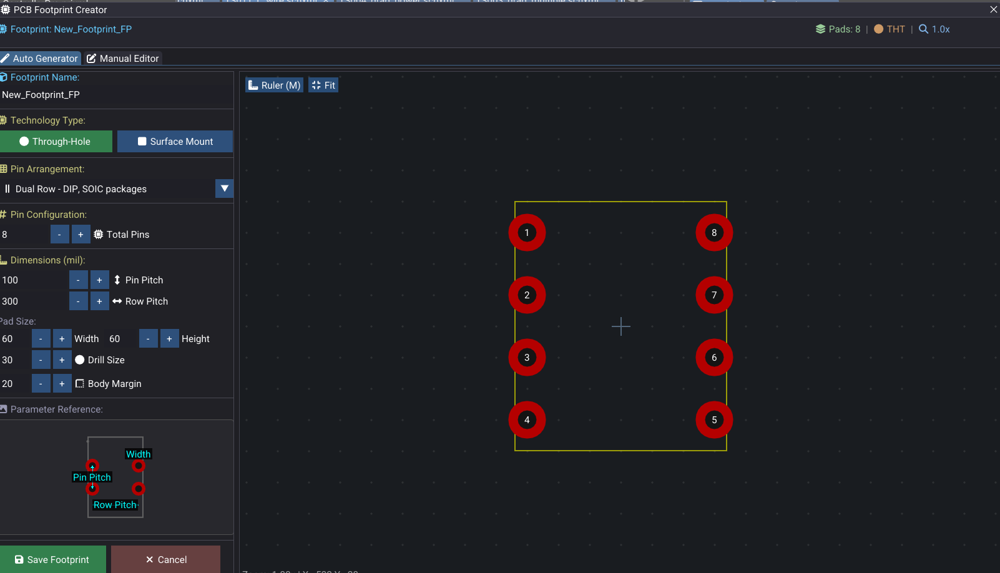

# Footprint Libraries (PCB)

Footprint libraries define physical packages for PCB components. This page covers loading, footprint structure, the built-in footprint generator, and 3D model alignment.

---

## Loading Footprint Libraries

From the Library panel when a PCB document is active:

1. Click **Load Footprints…**
2. Select one or more KiCad `.kicad_mod` library files.
3. WireFrame parses footprints in the background using the KiCad footprint parser.
4. On completion, `loadFootprints` merges the results.
5. Footprint names appear in the Library panel list and can be filtered.

---

## Footprint Data

Each footprint data contains:

| Data | Description |
|---|---|
| **Name** | Footprint identifier (e.g., "SOT-23", "R_0603_1608Metric") |
| **Library name** | Source library filename |
| **Description** | Human-readable description and tags |
| **Pads** | See pad properties table below |
| **Graphics** | Lines, circles, arcs, polygons, reference/value text |
| **3D model** | File path (STEP/OBJ) + offset, scale, rotation |

### Pad properties

| Property | Description | Example |
|---|---|---|
| Number | Pad number/name | `1`, `2`, `A1` |
| Position | X, Y in mm (converted to mils internally) | (0.0, 0.75) |
| Size | Pad width × height | 1.0 × 0.6 mm |
| Shape | Circle, Rect, Oval, RoundRect, Trapezoid, Custom | `rect` |
| Drill | Hole diameter and shape (for through-hole) | 0.8 mm circular |
| Layers | Copper and mask layers the pad belongs to | F.Cu, F.Mask, F.Paste |
| Net name | Assigned net (when imported with netlist) | `GND` |

These are converted into placed footprint instances when added to the PCB.

---

## Footprint Generator (Footprint Wizard)

The footprint wizard is a built-in footprint generator for common package types. Open it from **Tools → Footprint Wizard**.

### Supported layouts

| Layout | Description | Example |
|---|---|---|
| **Single row** | Pads in one line | SIP headers |
| **Dual row** | Two parallel rows | DIP, SOIC, SOT-23 |
| **Grid** | Rectangular array | BGA, LGA |
| **Quad** | Pads on all four sides | QFP, QFN |

### Configurable settings (footprint settings)

| Setting | Description |
|---|---|
| Pin count | Total number of pads |
| Layout type | Single, dual, grid, quad |
| Pad size | Width × height |
| Hole size | Drill diameter (for through-hole) |
| Horizontal pitch | Spacing between pads horizontally |
| Vertical pitch | Spacing between pads/rows vertically |
| Body margin | Clearance for the courtyard outline |

### Workflow

1. Configure pins, pitch, and pad size in the wizard controls.
2. The **preview canvas** shows the generated footprint in real time:
    - Pads on a green background.
    - Grid and axis lines.
    - Pin numbers and body outline.
3. Click **Export** to save as a KiCad `.kicad_mod` file via the KiCad export function.
4. Load the exported file into your footprint library.

<!-- TODO: Replace with actual screenshot
     Capture the Footprint Wizard dialog:
     - _**Left side**: Controls for pin count (e.g., 8), layout type (dropdown: "Dual Row"), pad size fields (0.6 × 1.0 mm), pitch fields (1.27 mm), hole size (0.4 mm)._
     - _**Right side**: A live preview canvas showing the generated footprint — 8 pads in two rows of 4, with pin numbers labeled (1–8), a body outline rectangle, and axis crosshairs._
     - _An "Export to .kicad_mod" button at the bottom._
     Suggested size: 800×500px.
-->

---

## 3D Model Alignment

3D model parameters for footprints are edited via the Model Alignment Dialog:

1. Select a footprint on the PCB.
2. Open the model alignment dialog from **PCB Properties** or **context menu → Edit 3D Model**.
3. The dialog shows:

| Control | Description |
|---|---|
| Model file path | Path to the STEP/OBJ model file |
| 3D preview | Live rendering via the 3D renderer |
| Offset (X, Y, Z) | Position adjustment |
| Scale (X, Y, Z) | Size adjustment |
| Rotation (X, Y, Z) | Orientation adjustment |

4. Adjust values and see the model update in the preview.
5. Save changes — WireFrame writes updated parameters back to the `.kicad_mod` file.

<!-- TODO: Replace with actual video
     Record a 15-second clip:
     1. _Open the Model Alignment Dialog for a footprint (e.g., an SOT-23 transistor)._
     2. _The 3D preview shows the footprint pads with a 3D model positioned on top._
     3. _Adjust the Y offset — the model slides forward/backward in the preview._
     4. _Adjust the Z rotation — the model rotates to align with the pads._
     5. _The model now sits correctly on the footprint._
     Resolution: 1280×720 at 30fps.
-->
<video controls width="100%">
  <source src="../../img/libraries/3d-model-alignment.webm" type="video/webm">
  <source src="../../img/libraries/3d-model-alignment.mp4" type="video/mp4">
  Your browser does not support the video tag.
</video>

---

## Importing Footprint Libraries from Other EDA Tools

### Importing Altium footprint libraries

WireFrame can convert Altium PCB libraries:

1. Go to **File → Import → Altium Library…**
2. Select an Altium footprint library file (`.PcbLib`).
3. WireFrame converts the footprints (pads, graphics, 3D models references) and adds them to your library.

| Altium format | Conversion details |
|---|---|
| `.PcbLib` | Pads, copper graphics, silkscreen, courtyard, 3D model paths |
| `.IntLib` | Both symbols and footprints extracted |

!!! warning "3D model paths"
    Altium 3D model references (`.step`, `.stp`) are imported but the file paths may need to be updated to match your local model directory. Use the [Model Alignment Dialog](#3d-model-alignment) to verify and adjust.

### Importing Eagle footprint libraries

Eagle library files (`.lbr`) contain footprints alongside symbols:

1. Go to **File → Import → Eagle Library…**
2. Select an Eagle `.lbr` file.
3. WireFrame extracts footprints with pads, graphics, and drill information.
4. Footprints appear in the Library panel when a PCB is active.

### Converting between formats

You can also export footprints from WireFrame to KiCad format:

1. Use the **Footprint Wizard** to create a footprint.
2. Click **Export** to save as a `.kicad_mod` file.
3. This file can be shared with KiCad users or imported into other KiCad-compatible tools.

---

## See Also

- [Footprints & Placement](../pcb/footprints-and-placement.md) — place footprints from loaded libraries.
- [Symbol Libraries](symbols-library.md) — the schematic-side library counterpart.
- [3D Viewer](../advanced/3d-viewer.md) — preview footprints with 3D models on the full board.
