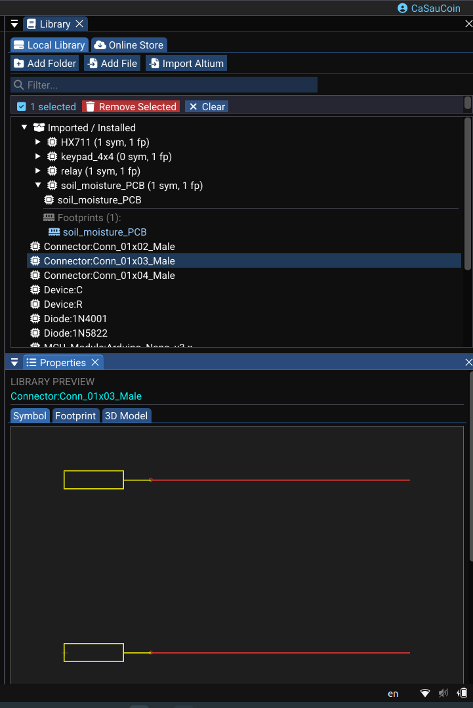

# Symbol Libraries (Schematic)

Symbol libraries define the electrical symbols used in schematic design. This page covers loading, structure, built-in symbols, and footprint linking.

---

## Loading Symbol Libraries

From the Library panel when a schematic is active:

1. Click **Load Symbols…**
2. Select one or more KiCad symbol files (`.kicad_sym`).
3. WireFrame parses the selected files immediately.
4. Once complete, results are merged into the symbol library map.
5. Available symbol names appear in a filterable list.

<!-- TODO: Replace with actual screenshot
     Capture the Library panel showing loaded symbols:
     - _A search box at the top (empty or with a partial filter)._
     - _A list of 10–15 symbol names (e.g., "R", "C", "LED", "STM32F103", "LM7805", "Conn_01x04")._
     - _A status line at the bottom: "Ready — 150 symbols loaded from 3 libraries"._
     Suggested size: 280×400px.
-->

---

## Symbol Structure

Each parsed symbol data includes:

| Data | Description |
|---|---|
| **Pins** | Name, number, position, angle, length, electrical type (input/output/power), visibility |
| **Graphics** | Rectangles, polylines, circles, arcs that form the symbol outline |
| **Texts** | Reference ("R?"), Value, user-defined texts |
| **Properties** | Footprint (default footprint name), BOM inclusion flags, parent symbol |

### Pin types

| Electrical type | Description |
|---|---|
| Input | Signal input pin |
| Output | Signal output pin |
| Bidirectional | Can be input or output |
| Power | Power pin (VCC, GND) |
| Passive | Passive component pin (resistor, capacitor) |
| Open Collector | Output that can only sink current |

### Symbol inheritance

- Inheritance resolution merges properties from **parent symbols** before use.
- Child symbols inherit graphics and pins from their parent, then override or add to them.

---

## Virtual / Built-In Symbols

The built-in component library and the component manager provide simplified built-in components that don't require external library files:

| Symbol | Pins | Purpose |
|---|---|---|
| `NetLabel` | 1 pin at origin | Net naming label |
| `VCC` | 1 pin | Positive power rail symbol |
| `GND` | 1 pin | Ground reference symbol |
| `VDD` | 1 pin | Alternative positive power symbol |

These are used by the toolbar buttons for quick placement of power symbols and net labels.

---

## Linking Footprints to Symbols

the footprint linking feature associates a default footprint with a symbol in the library:

### How it works

1. Select a symbol in the Library panel.
2. Use the **Link Footprint** action (right-click menu or button).
3. Choose a footprint from the loaded footprint libraries.
4. The symbol's `Footprint` property is updated in the `.kicad_sym` file via an internal process.

### Result

- Future instances of that symbol automatically get the linked footprint in their properties.
- Existing placed components are **not retroactively updated** — edit them individually if needed.

<!-- TODO: Replace with actual screenshot
     Capture the footprint linking UI:
     - _A symbol selected in the Library panel (e.g., "R" highlighted)._
     - _A dialog or dropdown showing available footprints (e.g., "R_0402_1005Metric", "R_0603_1608Metric", "R_0805_2012Metric")._
     - _A "Link" or "Assign" button._
     - _After linking: the symbol's Properties showing "Footprint: R_0603_1608Metric"._
     Suggested size: 500×400px.
-->
<video controls width="100%">
  <source src="../img/libraries/symbol-footprint-link.mp4" type="video/mp4">
  Your browser does not support the video tag.
</video>

---

## Importing Libraries from Other EDA Tools

### Importing Altium symbol libraries

WireFrame can convert Altium schematic libraries for use in your projects:

1. Go to **File → Import → Altium Library…**
2. Select an Altium symbol library file (`.SchLib` or `.IntLib`).
3. WireFrame converts the symbols and adds them to your library panel.

| Altium format | Support |
|---|---|
| `.SchLib` | Full import — symbols, pins, graphics |
| `.IntLib` | Extracted and converted (integrated libraries) |

!!! info "Post-import review"
    After importing Altium symbols, verify pin assignments and footprint links. Some Altium-specific properties may not have a direct equivalent in WireFrame.

### Importing Eagle symbol libraries

Eagle library files (`.lbr`) contain both symbols and footprints. When importing:

1. Go to **File → Import → Eagle Library…**
2. Select an Eagle `.lbr` file.
3. WireFrame extracts both symbols and footprints from the file.
4. Symbols appear in the Library panel when a schematic is active.

!!! note "Eagle version"
    Only Eagle XML format (version 6+) is supported for library import.

---

## See Also

- [Placing Components](../schematic/placing-components.md) — place symbols from loaded libraries.
- [Footprint Libraries](footprints-library.md) — the PCB-side library counterpart.
- [File Formats](../reference/file-formats.md) — KiCad `.kicad_sym` format details.
