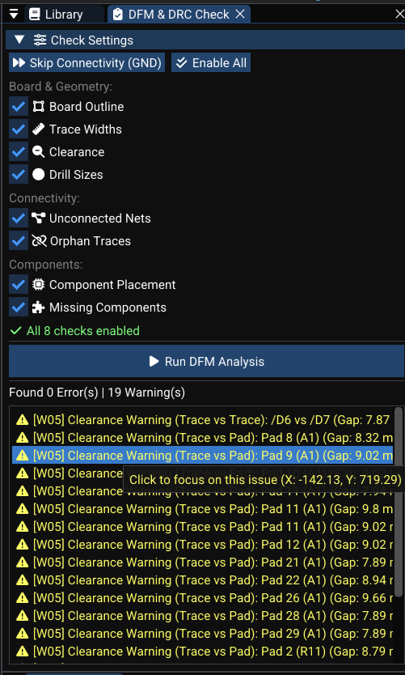

# DFM and DRC Checks

The the DFM engine runs Design For Manufacturability (DFM) and Design Rule Check (DRC) analyses on a the PCB document, producing a list of violations to fix before manufacturing.

---

## Running Checks

1. Open the **DFM/DRC panel** from **Tools → DFM Check** or the Design Rules panel.
2. Click **Run DFM**.
3. WireFrame executes all check subroutines.
4. The results panel populates with violations.

### Executed checks

| Check | Function | Description |
|---|---|---|
| Board outline | `checkBoardOutline` | Validates outline geometry |
| Unconnected nets | `checkUnconnectedNets` | Finds nets with remaining ratsnest lines |
| Trace widths | `checkTraceWidths` | Verifies widths against net class minimums |
| Clearances | `checkClearance` | Checks spacing between copper elements |
| Drill sizes | `checkDrillSizes` | Validates via/hole diameters |
| Components | `checkComponents` | Checks for overlaps and out-of-bounds |
| Orphans | `checkOrphans` | Finds unconnected traces/vias |
| Missing components | `checkMissingComponents` | Identifies missing schematic footprints |

---

## Violation Format

Each a DFM violation entry contains:

| Field | Description | Example |
|---|---|---|
| `code` | Short identifier | `E01`, `W02` |
| `message` | Human-readable description | "Trace width below minimum for net class 'Power'" |
| `location` | Board position of the issue | (1200, 800) |
| `isCritical` | Error (true) or warning (false) | `true` |

<!-- TODO: Replace with actual screenshot
     Capture the DFM results panel after running checks:
     - _A list of violations with columns: **Severity** (icon), **Code**, **Message**, **Location**._
     - _2–3 **red error** rows (e.g., "E01: Unconnected net GND", "E03: Clearance violation at (450, 300)")._
     - _1–2 **yellow warning** rows (e.g., "W01: Trace width close to minimum")._
     - _A "Zoom to" button or clickable row for each violation._
     - _A summary line at the bottom: "3 errors, 2 warnings"._
     Suggested size: 600×350px.
-->

---

## Types of Checks (Detail)

### Board outline

- Ensures the board boundary is **well-formed** (not self-intersecting, not degenerate).
- Warns if **no outline is defined**.
- Flags footprints that **extend outside** the board area.

### Unconnected nets

- Uses the PCB netlist engine connectivity data.
- Reports nets where **ratsnest lines remain** (pins not connected by traces or zones).
- Each unconnected pin pair is listed as a violation.

### Trace widths

- Checks each trace width against its **net class minimum**:

| Net class | Min width | Example nets |
|---|---|---|
| Default | 6 mil | Signal nets |
| Power | 12 mil | VCC, GND |

- Flags traces below their class minimum.

### Clearances

- Computes distances between copper elements:

| Pair | Check |
|---|---|
| Trace ↔ Trace | Segment distance ≥ clearance |
| Trace ↔ Pad | Segment-to-circle/rect distance ≥ clearance |
| Pad ↔ Pad | Center distance minus radii ≥ clearance |
| Copper ↔ Board edge | Distance from outline ≥ edge clearance |

### Drill sizes

- Checks via and hole diameters against the **minimum allowed drill size**.
- Flags too-small drills that may be impossible to manufacture.

### Components

- Checks for **overlapping footprint bounding boxes** (potential physical collisions).
- Verifies all footprints are **inside the board boundary**.

### Orphans and missing components

- **Orphan traces/vias**: copper not connected to any pad or net.
- **Missing footprints**: components in the schematic netlist without corresponding placed footprints on the PCB.

---

## Viewing and Fixing Violations

### Navigating violations

1. **Double-click** a violation in the list — the view pans and zooms to the `location`.
2. The problematic area is centered on screen.
3. Fix the issue (reroute a trace, increase clearance, place a missing component, etc.).
4. **Re-run DFM** to verify the fix.

### Severity icons

| Severity | Icon | Meaning |
|---|---|---|
| **Error** (critical) | :material-close-circle:{ style="color: red" } | Must be fixed before fabrication |
| **Warning** | :material-alert:{ style="color: orange" } | Should be reviewed but may be acceptable |

<!-- TODO: Replace with actual video
     Record a 20-second clip:
     1. _Click "Run DFM" — the panel fills with 3–4 violations._
     2. _Double-click a clearance error — the view zooms to the tight area._
     3. _Drag the offending trace to increase clearance._
     4. _Click "Run DFM" again — the error count drops by one._
     5. _Repeat for another violation._
     Resolution: 1280×720 at 30fps.
-->
<video controls width="100%">
  <source src="../../img/pcb/dfm-fix-cycle.webm" type="video/webm">
  <source src="../../img/pcb/dfm-fix-cycle.mp4" type="video/mp4">
  Your browser does not support the video tag.
</video>

!!! warning "Export readiness"
    Do not export Gerber files until all **critical errors** (red) are resolved. Warnings should be reviewed but typically don't block production.

---

## See Also

- [Routing](routing.md) — fix trace-related violations by rerouting.
- [Zones & Planes](zones-and-planes.md) — zone connectivity affects unconnected-net checks.
- [Fabrication & Export](fabrication-and-export.md) — export only after DRC passes.
