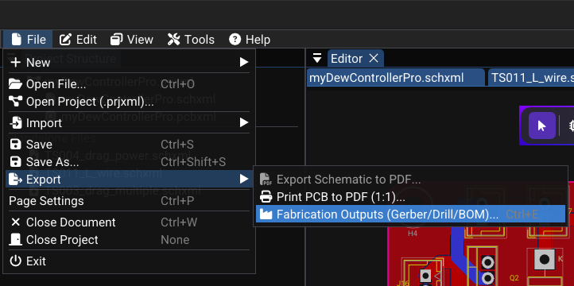

# Fabrication and Export

Once your design is complete and DFM passes cleanly, export manufacturing files to send to your PCB manufacturer — or to document your design.

---

## Export Types Overview

| File type | Format | Purpose |
|---|---|---|
| **Gerber** | RS-274X `.gbr` | PCB fabrication — copper, mask, silk, outline layers |
| **Drill** | Excellon `.drl` | Via and hole positions for CNC drilling |
| **BOM** | CSV `.csv` | Bill of Materials for component ordering |
| **Schematic PDF** | PDF `.pdf` | Printable schematic documentation |
| **Toner Transfer PDF** | PDF `.pdf` | **Hobbyist** — per-layer PDFs for manual PCB making |

---

## Schematic PDF Export

Exports your schematic as a vector PDF for printing or sharing.

**Steps:**

1. Open the **Schematic** tab you want to export
2. Select **File → Export → Export Schematic to PDF**
3. Choose a filename and directory
4. Click **Export**

**PDF content:**

| Element | Rendering |
|---|---|
| Components | Symbol outlines, pins, designator and value text |
| Wires and junctions | Black/grey lines and dots |
| Graphics | Rectangles, circles, text annotations |
| Title block | Page border, title, company, revision, date |

> Colors are converted to **black and grey** for print-friendly output.

---

## PCB Gerber Export

Gerber is the **industry-standard format** sent to PCB manufacturers. Each layer produces a separate `.gbr` file.

**Steps:**

1. Open the **PCB** tab
2. Select **File → Export → Fabrication Outputs (Gerber/Drill/BOM)** or **Tools → Fabrication Output**
3. Select the layers to export:

| Layer | Example filename | Purpose |
|---|---|---|
| F.Cu | `MyBoard-F_Cu.gbr` | Front copper |
| B.Cu | `MyBoard-B_Cu.gbr` | Back copper |
| F.SilkS | `MyBoard-F_SilkS.gbr` | Front silkscreen |
| F.Mask | `MyBoard-F_Mask.gbr` | Front solder mask openings |
| B.Mask | `MyBoard-B_Mask.gbr` | Back solder mask openings |
| Edge.Cuts | `MyBoard-Edge_Cuts.gbr` | Board outline for cutting |

4. Choose the **output directory**
5. Click **Export** — one `.gbr` file is generated per selected layer
6. *(Optional)* Compress all files into a **ZIP** to send to the manufacturer

!!! tip "Which files to send?"
    Typically: `F_Cu`, `B_Cu`, `F_SilkS`, `F_Mask`, `B_Mask`, `Edge_Cuts`, and the drill `.drl` file. Always check your manufacturer's specific requirements.

---

## Drill File Export

The drill file contains all **hole locations and diameters** — vias and mechanical holes.

Format: **Excellon NC drill** (text-based coordinate format)

Data included:
- X, Y coordinates for each via and hole
- Drill diameter per tool
- Plated vs. non-plated hole separation

---

## BOM Export (Bill of Materials)

The BOM is a **parts list** used to order components for assembly.

**Steps:**

1. Open the fabrication output workflow.
2. Include the BOM CSV in the coordinated package.
3. Open in Excel, LibreOffice Calc, or Google Sheets

**BOM file columns:**

| Designator | Value | Footprint | Layer |
|---|---|---|---|
| R1 | 10kΩ | R_0603_1608Metric | Top |
| R2 | 330Ω | R_0603_1608Metric | Top |
| C1 | 100nF | C_0805_2012Metric | Top |
| U1 | STM32F103 | LQFP-48 | Top |

!!! info "Before exporting the BOM"
    Only footprints with a **non-empty Value** field are included. Verify that all components have values assigned.

---

## Toner Transfer PDF (Hobbyist)

**Toner Transfer PDF** is a WireFrame feature designed for makers and hobbyists who produce PCBs manually using toner transfer or UV film methods.

- Generates **each selected layer as a separate PDF page**
- Output is **true 1:1 scale** — no page scaling
- **Automatically mirrors** layers that need to be printed reversed (e.g. F.Cu)
- WYSIWYG silkscreen — text renders exactly as it appears on the physical board

**Steps:**

1. Open the **Fabrication dialog**
2. Select **Toner Transfer PDF** as the export type
3. Choose the layers to include (e.g. F.Cu, B.Cu)
4. Click **Export** — each layer becomes a separate page in the PDF
5. Print on glossy paper at **100% scale (no fit-to-page)**

---

## Built-in Gerber Viewer

WireFrame includes a **Gerber viewer** to inspect exported files without external software.

**How to use:**

1. Select **Tools → Gerber Viewer** and open a generated `.gbr` file, or use another trusted Gerber viewer.
2. Select representative copper, mask, silkscreen, and outline outputs.
3. Pan and zoom to verify:
    - Trace continuity
    - Pad alignment and spacing
    - Board outline shape

Visually confirm trace continuity, pad flashes, apertures, and the board outline before sending the package to a manufacturer.

---

## Complete Export Workflow

1. Run DFM/DRC and resolve every release-blocking error.
2. Generate the coordinated fabrication package.
3. Review representative Gerber X2 layers and both drill outputs.
4. Check IPC-D-356A, BOM, and the package manifest.
5. Archive only the verified board revision and send that archive to the manufacturer.

### Image — Verified fabrication package

!!! note "Image capture brief"
    1. **Prepare:** Open a clean release-build workspace with fictional or public sample data and prepare the requested state.
    2. **Build the frame:** Capture the fabrication output dialog beside the generated package contents. Show the board revision and filenames, but no private customer path.
    3. **Clean the frame:** Close unrelated panels and tooltips, move the pointer away from key text, and hide credentials, usernames, customer data, and private paths.
    4. **Capture and finish:** Capture a native-resolution PNG, crop without cutting titles or primary actions, and add at most three subtle callouts without altering engineering content.
    5. **Approve:** Check the image at 100% zoom for current labels, readable evidence, correct release branding, and absence of sensitive information.

## Fabrication package contents

The release workflow can generate a coordinated package rather than a set of unrelated exports:

| Output | Purpose |
|---|---|
| **Gerber X2** | Copper, mask, silkscreen, and board geometry with generation metadata |
| **PTH / NPTH drill files** | Separates plated electrical holes from unplated mechanical holes |
| **IPC-D-356A netlist** | Electrical connectivity reference for fabrication test and CAM review |
| **BOM CSV** | Designators, values, footprints, and placement layer |
| **Manifest / README** | WireFrame version, generation time, and package inventory |

!!! warning "Inspect the archive"
    A successful export does not prove manufacturability. Confirm that Edge.Cuts is closed, drill classifications are correct, every expected layer is present, and the package matches the board revision being released.

---

## See Also

- [DFM & DRC](dfm-and-drc.md) — run checks before exporting
- [Layers & Views](layers-and-views.md) — layer selection for export
- [File Formats](../reference/file-formats.md) — detailed file format specifications
