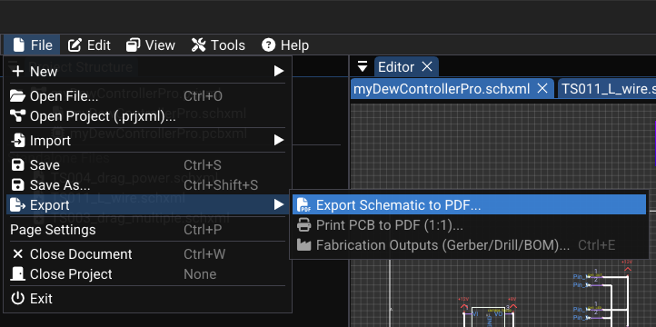
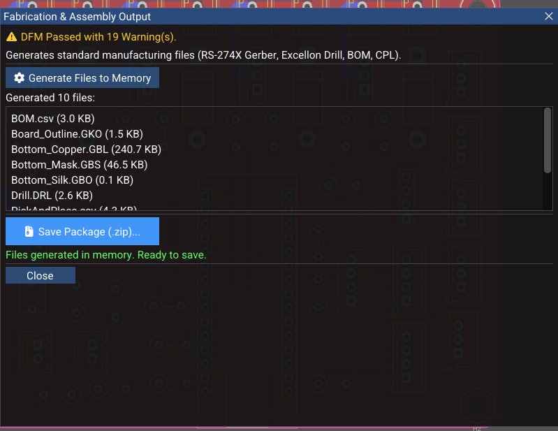

# Fabrication and Export

WireFrame exports production-ready files for PCB manufacturing and documentation. This page covers Gerber export, drill files, BOM, schematic PDFs, and the built-in Gerber viewer.

---

## Export Overview

| Export type | Format | Purpose |
|---|---|---|
| **Gerber** | RS-274X `.gbr` | Copper, mask, silk, and outline layers for PCB fabrication |
| **Drill** | Excellon `.drl` | Via and hole positions/diameters |
| **BOM** | CSV `.csv` | Bill of Materials for component ordering |
| **Schematic PDF** | PDF `.pdf` | Printable schematic documentation |

---

## Schematic PDF Export

`PdfExporter::exportSchematic` generates a vector-based PDF from a `SchematicDocument`:

### Content included

| Element | Rendering |
|---|---|
| Components | Outlines, pins, designator and value text |
| Wires and junctions | Black/grey lines and dots |
| Graphics | Rectangles, circles, text annotations |
| Title block | Border, title, company, revision, date |

Colors are converted to **black/grey** for print-friendly output.

### Steps

1. With a schematic active: **File → Export → Schematic PDF…**
2. Choose the output filename.
3. The PDF is written to disk.

<!-- TODO: Replace with actual screenshot
     Capture a generated schematic PDF opened in an external PDF viewer (e.g., browser or Acrobat):
     - _A full schematic page with components, wires, labels, and annotations rendered in black._
     - _The title block visible at the bottom-right with Title, Company, Revision, Date fields filled._
     - _Pin names and numbers visible on an IC symbol._
     - _The page border visible._
     Suggested size: 800×600px.
-->

---

## PCB Gerber Export

WireFrame generates RS-274X Gerber files — the industry standard for PCB fabrication data.

### What is exported per layer

| Element | Gerber representation |
|---|---|
| Traces | Stroked paths with round-capped ends, width in mm |
| Pads | Circular pads as flashes; rectangular/oval as drawn shapes |
| Zones | Filled polygons with optional holes |
| Board outline | Edge.Cuts layer as outlines |

### Export workflow

1. From a PCB document: **File → Export → Gerber…** (or open the **Fabrication** dialog).
2. Select which layers to export:

| Layer | Typical filename |
|---|---|
| F.Cu | `MyBoard-F_Cu.gbr` |
| B.Cu | `MyBoard-B_Cu.gbr` |
| F.SilkS | `MyBoard-F_SilkS.gbr` |
| F.Mask | `MyBoard-F_Mask.gbr` |
| B.Mask | `MyBoard-B_Mask.gbr` |
| Edge.Cuts | `MyBoard-Edge_Cuts.gbr` |

3. Choose the output directory.
4. Click **Export** — one `.gbr` file is generated per selected layer.
5. Optionally compress outputs into a **ZIP** for the manufacturer.

<!-- TODO: Replace with actual screenshot
     Capture the Fabrication/Gerber export dialog:
     - _A list of available layers with checkboxes (F.Cu ✓, B.Cu ✓, F.SilkS ✓, Edge.Cuts ✓, others unchecked)._
     - _An output directory field with a Browse button._
     - _An "Export" button (cyan accent)._
     - _After export: a status message or file list showing the generated `.gbr` files with file sizes._
     Suggested size: 600×400px.
-->

---

## Drill and NC Files

Drill files contain via and hole data for CNC drilling:

| Content | Description |
|---|---|
| Via positions | X, Y coordinates for each via |
| Hole positions | X, Y coordinates for each hole |
| Diameters | Drill tool sizes |
| Plating | Plated vs. non-plated hole separation |

Format: Excellon NC drill (text-based coordinate format).

---

## BOM (Bill of Materials)

WireFrame produces a CSV file from placed footprints:

### Columns

| Column | Description | Example |
|---|---|---|
| Designator | Component reference | R1, R2, U1 |
| Value | Component value | 10kΩ, 100nF, STM32F103 |
| Footprint | Package name | R_0603, LQFP-48 |
| Layer | Board side | Top / Bottom |

### Steps

1. From the Fabrication dialog or **File → Export → BOM…**
2. Choose the output `.csv` filename.
3. Open in a spreadsheet application for ordering or documentation.

!!! info "BOM content"
    Only footprints with a **non-empty Value** property are included. Ensure all components have values assigned before exporting.

<!-- TODO: Replace with actual screenshot
     Capture the generated BOM CSV opened in a spreadsheet application (LibreOffice Calc, Excel, or Google Sheets):
     - _Four columns visible: Designator, Value, Footprint, Layer._
     - _5–10 rows of data (e.g., R1/10kΩ/R_0603/Top, C1/100nF/C_0402/Top, U1/STM32F103/LQFP-48/Top)._
     - _Column headers in bold or with a distinct background._
     Suggested size: 600×350px.
-->

---

## Gerber Viewer

`GerberViewerDialog` is a built-in viewer for inspecting exported Gerber files without external software.

### Features

| Feature | Description |
|---|---|
| Parse Gerber commands | Reads a subset of RS-274X commands |
| Display traces/lines | Drawn with configured thickness |
| Display flashes (pads) | Shown as small circles/shapes |
| Pan and zoom | Navigate within the preview canvas |

### Usage

1. **Tools → Gerber Viewer** from the menu.
2. Open a generated `.gbr` file.
3. Pan and zoom to inspect:
    - Trace continuity.
    - Pad alignment.
    - Board outline integrity.

<!-- TODO: Replace with actual video
     Record a 15-second clip:
     1. _Open the Gerber Viewer dialog._
     2. _Load a generated F.Cu Gerber file._
     3. _The viewer renders the copper layer — traces and pads visible._
     4. _Pan to a dense area (e.g., QFP IC pads)._
     5. _Zoom in to verify pad spacing and trace routing._
     Resolution: 1280×720 at 30fps.
-->

[//]: # (<video controls width="100%">)

[//]: # (  <source src="../../img/fabrication/gerber-viewer.webm" type="video/webm">)

[//]: # (  <source src="../../img/fabrication/gerber-viewer.mp4" type="video/mp4">)

[//]: # (  Your browser does not support the video tag.)

[//]: # (</video>)

---

## See Also

- [DFM & DRC](dfm-and-drc.md) — run checks before exporting.
- [Layers & Views](layers-and-views.md) — layer selection for export.
- [File Formats](../reference/file-formats.md) — detailed format specifications.
