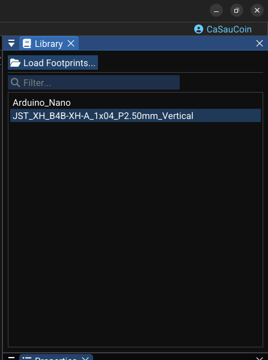

# Footprints and Placement

Footprints are the physical packages placed on the PCB, managed by the footprint system. This page covers loading libraries, placing, moving, rotating, flipping, and managing footprints.

---

## Loading Footprint Libraries

From the **Library panel** while a PCB document is active:

1. Click **Load Footprints…**
2. Select one or more KiCad footprint library files (`.kicad_mod`).
3. WireFrame parses footprint data via the KiCad footprint parser in the background.
4. Parsed footprint names appear in the list and can be filtered.

### Footprint data

Each loaded footprint contains:

| Data | Description |
|---|---|
| Pads | Number, position, shape (circle/rect/oval/roundrect), drill, layers |
| Graphics | Lines, arcs, circles, polygons, reference and value text |
| 3D model | Optional file path (STEP/OBJ) with offset, scale, rotation |
| Tags | Description and search tags for filtering |

<!-- TODO: Replace with actual screenshot
     Capture the Library panel in PCB mode:
     - _Search box at the top with a partial filter typed (e.g., "SOT")._
     - _A filtered list showing footprint names: "SOT-23", "SOT-23-5", "SOT-23-6"._
     - _Status bar showing "Ready — 85 footprints loaded"._
     - _If a preview area exists, show a small rendering of the selected footprint._
     Suggested size: 300×450px.
-->

---

## Placing Footprints

### From the schematic conversion (available footprints)

After converting a schematic to PCB, the PCB document maintains an **available footprints** list — components waiting to be placed:

1. Open a dialog listing unplaced schematic components and their footprints.
2. Select an item from the list.
3. Click on the board to place it.
4. The footprint appears with its `id` matching the schematic component (e.g., `U1`, `R3`).

### Direct placement from library

1. In the **Library panel**, double-click a footprint name.
2. The PCB enters **placement mode** — the footprint preview follows the mouse.
3. **Left-click** to place the footprint at the desired board location.

| Action | Input |
|---|---|
| Place footprint | Left-click |
| Rotate before placing | ++r++ |
| Cancel placement | Right-click or ++esc++ |

<!-- TODO: Replace with actual video
     Record a 15-second clip:
     1. _Double-click a footprint in the Library panel (e.g., "QFP-48")._
     2. _The footprint preview appears attached to the mouse cursor._
     3. _Press R to rotate it 90° — the preview rotates._
     4. _Click to place it on the board._
     5. _The footprint settles at the position with its pads and reference visible._
     Resolution: 1280×720 at 30fps.
-->
<video controls width="100%">
  <source src="../../img/pcb/placing-footprint.webm" type="video/webm">
  <source src="../../img/pcb/placing-footprint.mp4" type="video/mp4">
  Your browser does not support the video tag.
</video>

---

## Moving and Rotating Footprints

### Moving

1. **Select** one or more footprints.
2. **Click and drag** to move them on the board.
3. Connected traces and vias update their endpoints to stay attached.

an undoable move command captures:

- Old and new positions of all moved items (footprints, traces, vias, holes).
- Fully undoable — ++ctrl+z++ restores everything.

### Rotating

| Action | Input | Command |
|---|---|---|
| Rotate 90° | ++r++ or context menu | an undoable rotation command |

Rotation:

- Updates footprint angle.
- Recomputes all pad positions.
- Updates connected trace endpoints to match new pad locations.

<!-- TODO: Replace with actual video
     Record a 10-second clip:
     1. _Select 2–3 footprints with connected traces._
     2. _Press R — all selected footprints rotate 90° together._
     3. _Connected traces adjust their endpoints to maintain pad connections._
     4. _Undo to restore original orientation._
     Resolution: 1280×720 at 30fps.
-->

[//]: # (<video controls width="100%">)

[//]: # (  <source src="../../img/pcb/rotate-footprints.webm" type="video/webm">)

[//]: # (  <source src="../../img/pcb/rotate-footprints.mp4" type="video/mp4">)

[//]: # (  Your browser does not support the video tag.)

[//]: # (</video>)

---

## Flipping Footprints (Front ↔ Back)

To move a component to the opposite side of the board:

1. Select one or more footprints.
2. Press ++f++ or use **context menu → Flip**.
3. an undoable flip command toggles the board side:
    - Footprint layer changes (F.Cu ↔ B.Cu, F.SilkS ↔ B.SilkS, etc.).
    - Vias, holes, and graphics are also flipped if selected.
    - Executing the command again (undo) flips them back.

!!! info "Visual feedback"
    Flipped footprints change their appearance — the reference text may mirror and the layer color changes (e.g., red → blue for F.Cu → B.Cu).

---

## Editing Footprint Designators

Each a placed footprint has a designator text:

| Feature | Description |
|---|---|
| Designator text | Visible reference on the board (e.g., "R1", "U3") |
| Position | Can be dragged independently from the footprint body |
| Rotation | Can be rotated separately |
| Hit testing | Click on the text to select it specifically |

<!-- TODO: Replace with actual screenshot
     Capture a footprint with its designator being edited:
     - _A resistor footprint with its reference text "R1" selected and highlighted._
     - _The text being dragged slightly away from the pad area to avoid overlap with traces._
     - _The Properties panel showing the designator's position offset and font size._
     Suggested size: 500×350px.
-->

---

## Unplacing and Deleting Footprints

| Action | Command | Behavior |
|---|---|---|
| **Unplace** | Unplace command | Removes from board, returns to "available" list. Can be re-placed later. |
| **Delete** | Delete command / Delete command | Permanently removes footprint (and selected traces). Undoable. |

!!! tip "Unplace vs. Delete"
    Use **Unplace** when you want the component to remain in the schematic and be placed again later. Use **Delete** when removing it from the PCB entirely.

---

## See Also

- [Routing](routing.md) — route traces between placed footprints.
- [Footprint Libraries](../libraries/footprints-library.md) — creating and managing footprint libraries.
- [3D Viewer](../advanced/3d-viewer.md) — preview footprints with 3D models.
