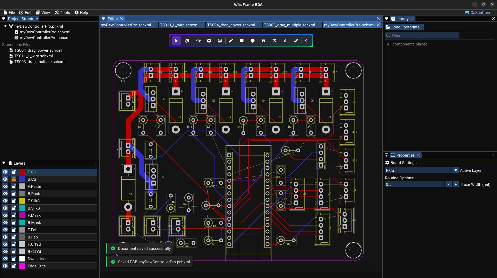

# PCB Editor — Overview

The PCB Editor handles board layout — from component placement to trace routing, copper zones, design rule checks, and manufacturing file export.

---

## What You Can Do Here

| Task | Tool |
|---|---|
| Place footprints from library or schematic | Library panel / Available Footprints dialog |
| Route copper traces between pads | Route Trace tool (++x++) |
| Place vias to switch routing layers | Via tool (++v++) |
| Add mechanical holes (screws, standoffs) | Place Hole tool |
| Define the board outline | Edge.Cuts layer + drawing tools |
| Fill copper zones (ground planes) | Zone / Fill GND Plane |
| Run DFM / DRC checks | Tools → DFM Check |
| Export Gerber, drill, BOM, PDF | File → Export or Fabrication dialog |
| Preview the board in 3D | View → 3D Viewer |

---

## Workspace

- **Canvas** — the board area with grid, footprints, traces, zones, and **ratsnest** lines (unrouted connections)
- **Toolbar** — floating tool buttons above the canvas
- **Layer panel** — toggle visibility and select the active routing layer
- **Library panel** — footprint list for placement
- **Properties panel** — edit properties of the selected PCB object

---

## PCB Toolbar Tools

| Tool | Shortcut | Function |
|---|---|---|
| **Select** | ++esc++ | Select and move objects |
| **Place Footprint** | — | Place a footprint from the library |
| **Route Trace** | ++x++ | Route copper traces between pads |
| **Draw Via** | ++v++ | Place a via manually |
| **Place Hole** | — | Place a mechanical hole |
| **Draw Line / Rect / Circle / Arc / Polygon** | — | Draw graphic shapes on any layer |
| **Draw Text** | — | Place text on silkscreen or fab layers |
| **Measure** | — | Measure distances on the board |

---

## Board Outline (Edge.Cuts)

Every PCB needs a board outline that defines its **physical shape**:

1. In the **Layer panel**, click **Edge.Cuts** to make it the active layer
2. Use the **Draw Rectangle** (or Polygon) tool to draw the board shape
3. The outline appears in magenta

!!! tip "Why Edge.Cuts matters"
    The board outline is used for:
    - Telling the manufacturer where to cut the board
    - Defining the valid placement area for footprints (DFM checks this)
    - Clipping copper zone fills at the board edge

---

## Ratsnest Lines

Ratsnest lines are **thin dashed lines** showing connections that have not yet been routed:

<video controls width="100%">
  <source src="../img/pcb/ratsnest-demo.mp4" type="video/mp4">
  Your browser does not support the video tag.
</video>

- Ratsnest lines **automatically update** after every edit
- When you **route a trace**, the corresponding ratsnest line **disappears**
- The goal is to **route until all ratsnest lines are gone**

---

## Section Pages

| Page | What you'll learn |
|---|---|
| [Footprints & Placement](footprints-and-placement.md) | Load libraries, place and arrange footprints |
| [Routing](routing.md) | Route traces, vias, mechanical holes |
| [Layers & Views](layers-and-views.md) | Layer management, visibility, navigation |
| [Zones & Planes](zones-and-planes.md) | Copper fills, ground planes, zone priority |
| [Design Rules & Net Classes](design-rules.md) | Clearance, trace width, via size, net class configuration |
| [DFM & DRC](dfm-and-drc.md) | Design rule and manufacturability checks |
| [Fabrication & Export](fabrication-and-export.md) | Gerber, drill, BOM, PDF export |

---

## Related Sections

| Section | What you'll learn |
|---|---|
| [3D Viewer](../advanced/3d-viewer.md) | Preview the PCB with 3D component models |
| [AI Auto-Router](../ai/auto-placer-router.md) | Automatic A* trace routing via AI Copilot |

