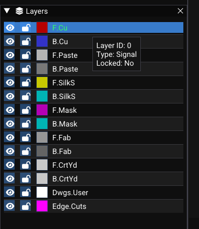

T# Layers and Views

ooPCB layers control visibility, color, and rendering of board elements. This page covers layer definitions, the Layer panel, rendering behavior, and view controls.

---

## Layer Definitions

WireFrame defines the board layer stack. Each layer has:

| Property | Description |
|---|---|
| ID | Layer identifier (e.g., F.Cu) |
| `name` | Display name (e.g., "F.Cu", "B.SilkS") |
| `type` | Layer type: Signal, Silk, Mask, Paste, Fab, Edge, User |
| `color` | Rendering color (editable) |
| `isVisible` | Whether the layer is drawn on the canvas |

### Default layer stack

| Layer | Type | Typical color | Purpose |
|---|---|---|---|
| **F.Cu** | Signal | Red | Front copper (traces, pads) |
| **B.Cu** | Signal | Blue | Back copper |
| **F.SilkS** | Silk | Yellow | Front silkscreen (labels, outlines) |
| **B.SilkS** | Silk | Magenta | Back silkscreen |
| **F.Mask** | Mask | Purple | Front solder mask openings |
| **B.Mask** | Mask | Green | Back solder mask openings |
| **F.Paste** | Paste | Light red | Front solder paste |
| **B.Paste** | Paste | Light blue | Back solder paste |
| **F.Fab** | Fab | Grey | Front fabrication layer |
| **B.Fab** | Fab | Grey | Back fabrication layer |
| **F.CrtYd** | Courtyard | Light grey | Front courtyard (clearance areas) |
| **B.CrtYd** | Courtyard | Light grey | Back courtyard |
| **Edge.Cuts** | Edge | Magenta | Board outline / physical shape |
| **Dwgs.User** | User | Grey | User drawing annotations |

---

## Layer Panel (UI)

Open via **View → Toggle Layers** or from the sidebar. The panel shows a table:

| Column | Interaction |
|---|---|
| **Eye icon** | Click to toggle layer visibility (hidden layers are not rendered) |
| **Color patch** | Click to open a color picker and customize the layer color |
| **Layer name** | Click to set this layer as the **active routing/drawing layer** |

The **active layer** is highlighted with a distinct background (e.g., brighter or with a cyan indicator).

<!-- TODO: Replace with actual screenshot
     Capture the Layer panel:
     - _F.Cu shown first: eye icon enabled (visible), red color patch, **highlighted as the active layer** (brighter background or cyan indicator)._
     - _B.Cu: blue color patch, visible, not active._
     - _F.SilkS: yellow patch, visible._
     - _B.SilkS, F.Mask, B.Mask: some with eye icons toggled off (greyed out text)._
     - _Edge.Cuts: magenta patch, visible._
     - _At least 10 layers visible in the list._
     - _If a color picker is open (for one layer), show it as well._
     Suggested size: 280×500px.
-->

---

## Layer Colors and Rendering

Rendering uses layer colors throughout:

| Element | Color source |
|---|---|
| Traces | Color of the trace's assigned layer |
| Footprint graphics | Color from the layer system based on each graphic's layer |
| Pads | Typically follows copper layer color |
| Silkscreen | F.SilkS / B.SilkS layer color (default: yellow / magenta) |
| Board outline | Edge.Cuts layer color (default: magenta) |
| Zones | Semi-transparent fill using the zone's layer color |

### Hidden layers

- When a layer is hidden (eye icon off), its traces, graphics, and pads are **not drawn**.
- Underlying data still exists — you can still select and edit hidden-layer items if you know they're there.

---

## View Controls

### Navigation

| Action | Input |
|---|---|
| Pan | Middle mouse button drag |
| Zoom | Mouse scroll wheel (centered on cursor) |
| Fit to board | ++f++ (default) or **View → Fit to Screen** |
| Zoom to selection | ++shift+f++ |
| Zoom 100% | ++1++ |

<!-- TODO: Replace with actual video
     Record a 15-second clip:
     1. _A PCB with both F.Cu and B.Cu traces visible (red and blue)._
     2. _Click the eye icon for B.Cu — all back-side traces and blue pads disappear._
     3. _Click the eye icon for F.SilkS — silkscreen labels disappear._
     4. _Re-enable both layers — everything reappears._
     5. _Use the mouse wheel to zoom in on a dense area._
     Resolution: 1280×720 at 30fps.
-->
<video controls width="100%">
  <source src="../../img/pcb/layer-visibility.mp4" type="video/mp4">
  Your browser does not support the video tag.
</video>

---

## See Also

- [PCB Editor Overview](index.md) — general PCB workspace description.
- [Routing](routing.md) — the active layer determines which copper layer traces are routed on.
- [Fabrication & Export](fabrication-and-export.md) — layer selection for Gerber export.
