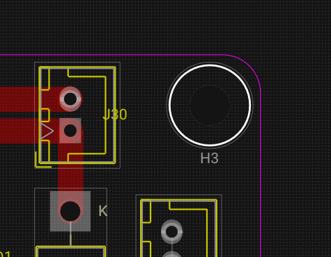
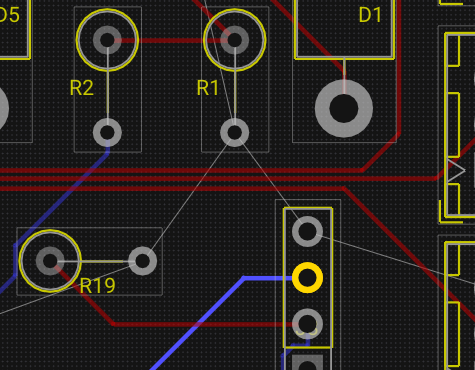

# Routing Traces

Trace routing connects pads on the PCB, enforcing electrical and design-rule constraints. This page covers the routing workflow, collision detection, trace editing, vias, holes, and routing helpers.

---

## Routing Mode

Select **Route Trace** from the PCB toolbar (or press ++x++).

### Drawing a trace

1. **Click on a pad** or existing trace segment to start routing.
2. The trace follows the mouse with **45° helper points** automatically computed.
3. **Left-click** to confirm each vertex (corner).
4. **Click on the destination pad** to finish the trace, or **right-click** / press ++esc++ to end.

| Action | Input |
|---|---|
| Start trace on a pad | Left-click |
| Add vertex | Left-click |
| Finish trace on pad | Left-click on target |
| Cancel current trace | Right-click or ++esc++ |
| Switch layer (place via) | ++v++ |

### Trace data

Each trace stores:

| Property | Description | Example |
|---|---|---|
| `id` | Unique trace identifier | `trace_42` |
| `netName` | Electrical net this trace belongs to | `GND`, `SDA` |
| `layer` | Copper layer ID | `F.Cu`, `B.Cu` |
| `width` | Trace width in board units (mils) | `10` |
| `points` | Ordered polyline vertices | World coordinates |

<!-- TODO: Replace with actual video
     Record a 20-second clip:
     1. _Press X to activate the Route Trace tool._
     2. _Click on a pad of U1 — the net name highlights and a trace starts._
     3. _Move the mouse — a 45° guided path is shown._
     4. _Click to add a vertex (corner)._
     5. _Click on the destination pad of R1 — the trace completes._
     6. _The ratsnest line between U1 and R1 disappears._
     Resolution: 1280×720 at 30fps.
-->
<video controls width="100%">
  <source src="../../img/pcb/routing-trace.webm" type="video/webm">
  <source src="../../img/pcb/routing-trace.mp4" type="video/mp4">
  Your browser does not support the video tag.
</video>

---

## Collision and Clearance Checks

WireFrame checks clearance in real time during routing:

| Check | Against |
|---|---|
| Trace-to-trace | Other traces on the same layer (width + clearance) |
| Trace-to-pad | Footprint pads on the same layer |
| Trace-to-via/hole | Via and hole drill areas |
| Trace-to-outline | Board edge (Edge.Cuts) |
| Trace-to-zone | Copper zone boundaries |

Routing helpers:

- **Red warning indicator** appears if the route gets too close to another copper element.
- The system prevents completing segments that violate clearance rules.

<!-- TODO: Replace with actual screenshot
     Capture a routing scenario with collision feedback:
     - _A trace being routed between two pads._
     - _The trace approaching another existing trace on the same layer._
     - _A **red highlight or warning indicator** appearing at the point where clearance is violated._
     - _The cursor position showing the collision zone._
     Suggested size: 600×400px.
-->

[//]: # (![Routing Collision]&#40;../img/pcb/routing-collision.png&#41;)

---

## Editing Existing Traces

| Operation | How | Command |
|---|---|---|
| **Move entire trace** | Select + drag | An undoable move command |
| **Drag a segment** | Click and drag one segment | Keeps adjacent segments constrained |
| **Delete trace** | Select + ++delete++ | Delete command (marks net dirty) |

!!! info "Net rebuild"
    Deleting or modifying traces marks the affected nets as dirty. The ratsnest is automatically recomputed to show any broken connections.

---

## Vias and Layer Changes

### During routing

1. While routing on **F.Cu**, press ++v++.
2. A **via** is placed at the current cursor position.
3. The active routing layer switches to **B.Cu**.
4. Continue routing on the new layer from the via point.

### Via properties

| Property | Description | Default |
|---|---|---|
| `id` | Unique via ID | Auto-generated |
| `position` | Board coordinates | Cursor position |
| `netName` | Net inherited from connected trace | Same as trace |
| `diameter` | Via copper diameter | From Design Rules |
| `drill` | Drill hole diameter | From Design Rules |

### Manual via placement

1. Select the **Draw Via** tool.
2. Click on the board to place a via.
3. Assign the net in the Properties panel if needed.

---

## Mechanical Holes

Use the **Place Hole** tool to add non-electrical holes:

1. Click on the board to place a hole.
2. Set parameters in the Properties panel:

| Property | Description |
|---|---|
| `diameter` | Hole diameter (e.g., 3.2 mm for M3 screws) |
| `plated` | Whether the hole has copper plating |
| `netName` | Net name if plated (e.g., GND for grounding) |

<!-- TODO: Replace with actual screenshot
     Capture a board section showing:
     - _Several **vias** along a routed trace, connecting F.Cu to B.Cu (visible as circles with drill markers)._
     - _Four **mounting holes** at the board corners (larger diameter, non-plated)._
     - _Vias showing their net coloring (same color as the connected trace)._
     - _The board outline (Edge.Cuts) visible at the edges._
     Suggested size: 600×400px.
-->

---

## Sticky Endpoints and Advanced Dragging

WireFrame maintains smart connections during drag operations:

- **Moving a via**: traces attached to the via remain connected — endpoints follow the via position.
- **Moving a footprint**: connected trace endpoints adjust to maintain pad connections via trace endpoint update.
- **StickyEndpoint** structures ensure trace endpoints stay snapped to pads or vias during selection moves.

---

## Autorouting Helpers

WireFrame provides several routing assistance functions:

| Function | Description |
|---|---|
| `calculate45DegreeRoute` | Generates clean 45° path between start and end points |
| `applyMitering` | Rounds corners with mitering arcs |
| `glossTrace` | Simplifies trace geometry by removing redundant vertices and smoothing short zig-zags |

<!-- TODO: Replace with actual video
     Record a 10-second clip:
     1. _A routed trace with some jagged corners and short zig-zag segments._
     2. _Apply the "Gloss" action (via menu or shortcut)._
     3. _The trace simplifies — corners become clean 45° bends, redundant vertices disappear._
     Resolution: 1280×720 at 30fps.
-->

[//]: # (`<video controls width="100%">)

[//]: # (  <source src="../../img/pcb/gloss-trace.webm" type="video/webm">)

[//]: # (  <source src="../../img/pcb/gloss-trace.mp4" type="video/mp4">)

[//]: # (  Your browser does not support the video tag.)

[//]: # (</video>`)

---

## See Also

- [Footprints & Placement](footprints-and-placement.md) — place the footprints that traces connect.
- [Layers & Views](layers-and-views.md) — manage layer visibility during routing.
- [Zones & Planes](zones-and-planes.md) — copper fills that interact with traces.
- [DFM & DRC](dfm-and-drc.md) — check trace clearances and widths after routing.
