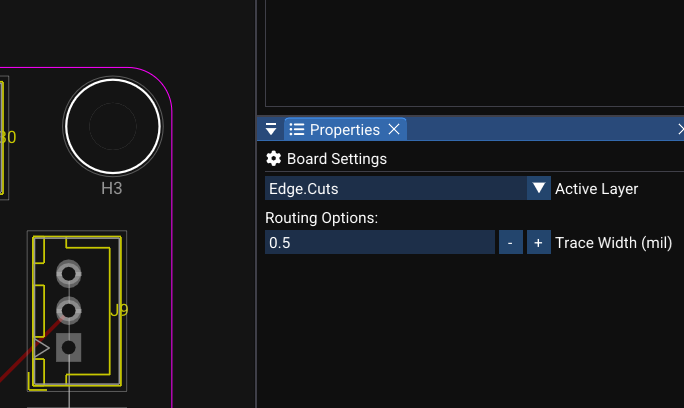

# Zones and Copper Planes

Copper zones (fills / pours) cover a board area with copper — typically used for **ground planes** or **power planes**. This is a standard practice in professional PCB design.

---

## Why Use Zones?

- **Ground plane** — reduces EMI noise and improves RF signal integrity
- **Power plane** — reduces voltage drop on power rails
- **Larger copper area** → lower impedance → better heat dissipation

---

## What Is a Zone?

A filled zone follows its outline while maintaining clearance around objects on other nets. Pads on the zone net connect according to the configured zone connection style.

Each zone has:

| Property | Description |
|---|---|
| **Net** | The net name (e.g. `GND`, `VCC`) |
| **Layer** | Copper layer (e.g. F.Cu, B.Cu) |
| **Priority** | Higher-priority zones override lower ones where they overlap |
| **Clearance** | Minimum gap from pads and traces on other nets |
| **Outline** | The polygon you draw to define the zone boundary |

---

## Quick Ground Plane

The fastest way — use **Fill GND Plane**:

1. Use **Fill GND Plane** from the active PCB's zone or toolbar controls.
2. WireFrame automatically:
    - Reads the board outline from Edge.Cuts
    - Creates a GND zone covering the entire board interior
    - Computes clearance gaps around all pads and traces not on GND
    - Connects GND pads directly into the fill

<video controls width="100%">
  <source src="../img/pcb/fill-gnd-plane.mp4" type="video/mp4">
  Your browser does not support the video tag.
</video>

---

## Creating a Zone Manually

1. Select a copper layer (e.g. **F.Cu**) in the Layer panel
2. Use the **Draw Polygon** tool to draw a closed polygon boundary
3. Assign zone properties:
    - **Net name** (e.g. `GND`)
    - **Clearance** (e.g. 0.2 mm)
    - **Priority** (default: 0)
4. WireFrame computes and renders the copper fill

---

## Zone Priority

When two zones overlap, the zone with the **higher priority** wins:

The higher-priority zone owns the overlapping copper area; the lower-priority zone remains in the rest of its valid outline.

### Image — Overlapping zones with different priorities

!!! note "Image capture brief"
    1. **Prepare:** Open a clean release-build workspace with fictional or public sample data and prepare the requested state.
    2. **Build the frame:** Capture a GND zone at priority 0 and a smaller VCC island at priority 1. Show the zone outlines, net labels, and resulting filled overlap.
    3. **Clean the frame:** Close unrelated panels and tooltips, move the pointer away from key text, and hide credentials, usernames, customer data, and private paths.
    4. **Capture and finish:** Capture a native-resolution PNG, crop without cutting titles or primary actions, and add at most three subtle callouts without altering engineering content.
    5. **Approve:** Check the image at 100% zoom for current labels, readable evidence, correct release branding, and absence of sensitive information.

!!! tip "Priority guidelines"
    - Ground plane → priority **0** (lowest)
    - VCC island inside the GND plane → priority **1**
    - Zone nested inside VCC → priority **2**, and so on

---

## How Zones Interact with Nets

| Situation | Result |
|---|---|
| Pad on the **same net** as the zone | Pad connects directly to the fill (no ratsnest) |
| Trace on the **same net** passing through | Trace connects to the zone |
| Pad on a **different net** inside the zone | Clearance gap is maintained around the pad |
| Trace on a **different net** inside the zone | Clearance gap is maintained around the trace |

---

## Editing Zones

| Property | Editable |
|---|---|
| Net name | ✅ — in Properties panel |
| Layer | ✅ |
| Priority | ✅ |
| Clearance | ✅ |
| Outline (vertices) | ✅ — drag vertices to reshape the boundary |
| Cutouts | ✅ — add excluded shapes inside the zone |

---

## See Also

- [Routing](routing.md) — traces interact with zone clearances
- [DFM & DRC](dfm-and-drc.md) — zone connectivity is validated during DRC
- [Layers & Views](layers-and-views.md) — zone visibility follows layer settings
