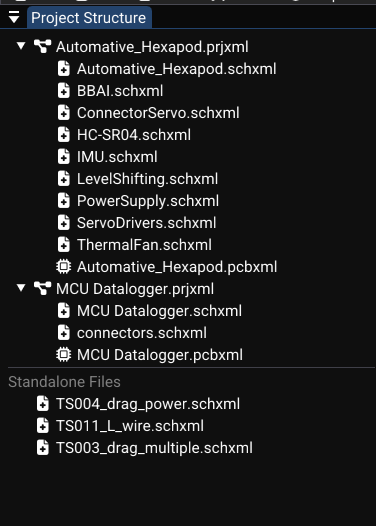

# Projects and Files

WireFrame uses a project-oriented structure to keep schematics, PCBs and libraries organized. This page explains the project file format, document types, and how they link together.

---

## Project Files (`.prjxml`)

A project file (`*.prjxml`) is an XML document that stores:

| Content | Description |
|---|---|
| Schematic list | Paths to all `.schxml` files in the project |
| PCB list | Paths to all `.pcbxml` files in the project |
| Library folder | Default folder for symbol and footprint libraries |
| Library references | Specific library files used by the project |

### Creating a project

1. **File → New Project…**
2. Choose a location and `.prjxml` filename.
3. WireFrame:
    - Creates the project file.
    - Sets the project root directory (parent folder of the `.prjxml`).
    - Creates a default library folder (e.g., `lib/`) if needed.

<!-- TODO: Replace with actual screenshot
     Capture the "New Project" dialog:
     - _A file browser dialog with the filename field showing a sample name (e.g., "MyBoard.prjxml")._
     - _The parent folder visible in the directory path._
     - _The "Create" or "Save" button highlighted._
     Suggested size: 600×400px.
-->
<video controls width="100%">
  <source src="../img/projects/new-project-dialog.mp4" type="video/mp4">
  Your browser does not support the video tag.
</video>

### Opening a project

1. **File → Open Project…**
2. Select a `.prjxml` file.
3. The **Project Structure** panel parses the XML and displays:
    - `<Schematics>` → schematic file entries.
    - `<PCBs>` → PCB file entries.
    - `<Libraries>` → symbol and footprint library references.

<!-- TODO: Replace with actual screenshot
     Capture the Project Structure panel after opening a multi-file project:
     - _Project node expanded ("PowerSupply.prjxml")._
     - _"Schematics" section with 2–3 schematic files listed._
     - _"PCBs" section with 1 PCB file._
     - _File icons distinguishing schematic from PCB documents._
     Crop to the panel only. Suggested size: 300×450px.
-->

### Adding files to a project

Right-click the project node or a section (Schematics / PCBs) in the Project Structure panel:

- **Add Existing…** — browse for an existing `.schxml` or `.pcbxml` to link into the project.
- **Add New…** — create a new schematic or PCB and automatically register it in the project.

---

## Schematics (`.schxml`)

Each schematic document includes:

| Content | Description |
|---|---|
| Components | Placed symbols with IDs, positions, rotations, and attributes |
| Wires | Wire vertices, pin attachments, and net names |
| Graphics | Lines, rectangles, circles, arcs, polygons, text |
| Page settings | Paper size, title block (title, company, revision, date, author) |

### Key behaviors

- The schematic **netlist** is rebuilt from wires and labels using the netlist engine.
- Components are tied to **symbol definitions** from loaded libraries (via the library system).
- **Cross-document mapping**: schematic component IDs can be linked to PCB footprints by matching IDs.

### Saving

- **File → Save** (++ctrl+s++) — updates the `.schxml` via the save function.
- **File → Save As…** (++ctrl+shift+s++) — writes to a new file and updates the document path.

---

## PCBs (`.pcbxml`)

Each PCB document records:

| Content | Description |
|---|---|
| Footprints | Placed packages with positions, rotations, pads, and layers |
| Traces & vias | Routed connections with net names, widths, and layer assignments |
| Holes | Mechanical and plated holes with diameters |
| Graphics | Board outline, dimensions, silkscreen text and shapes |
| Netlist | Net definitions and pin-to-net assignments |
| Zones | Copper zone outlines and computed fill islands |
| Design rules | Net classes, clearances, trace widths, via/drill sizes |

### Saving

- **File → Save** — calls the save function with all board data (footprints, traces, layers, netlist, drawings, zones, design settings).
- **File → Save As…** — writes to a new file path.

---

## Linking Schematics and PCBs

The typical workflow for linking a schematic to a PCB:

1. **Design the schematic** and assign footprints to all components (via symbol properties).
2. Use **Project → Convert to PCB** (or equivalent) to:
    - Create a new PCB document.
    - Populate footprints matching schematic component IDs.
    - Transfer the netlist (net names and pin connections) to the PCB.
3. **Later updates**: changes in the schematic can be re-applied to the PCB by updating netlists. Modified or added nets are marked dirty and the ratsnest is recomputed.

<!-- TODO: Replace with actual video
     Record a 20–30 second screen capture showing:
     1. _A completed schematic with 5–6 components, wires, and labels visible._
     2. _The user clicking "Project → Convert to PCB" from the menu bar._
     3. _A new PCB tab appearing with footprints clustered together and ratsnest lines everywhere._
     4. _The user briefly panning around the new PCB to show all footprints loaded correctly._
     Resolution: 1280×720 at 30fps. Keep actions slow for clarity.
-->
<video controls width="100%">
  <source src="../img/projects/schematic-to-pcb.mp4" type="video/mp4">
  Your browser does not support the video tag.
</video>

!!! warning "Footprint assignment required"
    Components without a Footprint property in the schematic will be skipped during conversion. Always verify that every component has a footprint assigned before converting.

---

## Library Management

Projects can reference external library files for both symbols and footprints:

### Symbol libraries

- Loaded from KiCad `.kicad_sym` files.
- Registered in the project's `<Libraries>` section.
- Symbols are available in the Library panel when a schematic is active.

### Footprint libraries

- Loaded from KiCad `.kicad_mod` files.
- Also registered in the project's `<Libraries>` section.
- Footprints are available when a PCB is active.

### Managing library references

| Action | How |
|---|---|
| Add a library | Load it via the Library panel, then it's auto-registered |
| Remove a library | Right-click in Library panel → Unload |
| View library path | Check the `.prjxml` file's `<Libraries>` section |

!!! tip "Shared libraries"
    You can share a single set of library files across multiple projects by keeping them in a common folder and referencing the same path from each project.

---

## Importing Projects from Other EDA Tools

### Importing a KiCad project

WireFrame can import existing KiCad projects to bring in your schematics, PCB layouts, and library references:

1. Go to **File → Import → KiCad Project…**
2. Select the KiCad project file (`.kicad_pro` or `.pro`).
3. WireFrame reads the project structure and converts:

| KiCad file | Converted to |
|---|---|
| `.kicad_pro` / `.pro` | `.prjxml` (WireFrame project) |
| `.kicad_sch` | `.schxml` (WireFrame schematic) |
| `.kicad_pcb` | `.pcbxml` (WireFrame PCB) |
| `.kicad_sym` | Loaded as symbol library (no conversion needed) |
| `.kicad_mod` | Loaded as footprint library (no conversion needed) |

4. After import, the project appears in the **Project Structure** panel with all linked files.

<!-- TODO: Replace with actual screenshot
     Capture the "Import KiCad Project" dialog:
     - _A file browser showing `.kicad_pro` files._
     - _After import: the Project Structure panel showing the converted project with schematics and PCBs listed._
     Suggested size: 700×450px.
-->

<video controls width="100%">
  <source src="../img/projects/import-kicad.mp4" type="video/mp4">
  Your browser does not support the video tag.
</video>

!!! tip "Library compatibility"
    KiCad symbol (`.kicad_sym`) and footprint (`.kicad_mod`) libraries are natively supported — no conversion is needed. They are loaded directly by WireFrame.

### Importing an Altium project

WireFrame supports importing Altium Designer projects and libraries:

1. Go to **File → Import → Altium Project…**
2. Select the Altium project file (`.PrjPcb`).
3. WireFrame converts the project structure:

| Altium file | Converted to |
|---|---|
| `.PrjPcb` | `.prjxml` (WireFrame project) |
| `.SchDoc` | `.schxml` (WireFrame schematic) |
| `.PcbDoc` | `.pcbxml` (WireFrame PCB) |
| `.SchLib` / `.IntLib` | Symbol library (converted on import) |
| `.PcbLib` | Footprint library (converted on import) |

4. The imported project opens in the Project Structure panel.

<!-- TODO: Replace with actual screenshot
     Capture the "Import Altium Project" dialog:
     - _A file browser showing `.PrjPcb` files._
     - _An import progress dialog or log showing conversion status._
     - _After import: the Project Structure panel showing the converted project._
     Suggested size: 700×450px.
-->

<video controls width="100%">
  <source src="../img/projects/import-altium.mp4" type="video/mp4">
  Your browser does not support the video tag.
</video>

!!! warning "Altium import limitations"
    - Complex Altium features (room definitions, embedded components, advanced design rules) may not be fully converted.
    - Always review the imported design and run DRC after import.
    - Altium 3D model references may need to be re-linked if the model paths differ.

### Importing an Eagle project

WireFrame can also import Eagle (Autodesk) designs:

1. Go to **File → Import → Eagle Project…**
2. Select the Eagle schematic (`.sch`) or board (`.brd`) file.
3. WireFrame converts components, nets, traces, and board geometry.

| Eagle file | Converted to |
|---|---|
| `.sch` | `.schxml` (WireFrame schematic) |
| `.brd` | `.pcbxml` (WireFrame PCB) |
| `.lbr` | Symbol + footprint libraries (converted on import) |

!!! note "Eagle version support"
    Eagle XML format (version 6+) is supported. Binary formats from older Eagle versions are not supported.

---

## Session Restoration

The application stores session data (open projects and documents) in a user config file. On startup, WireFrame automatically:

1. Restores previously open **projects** (`.prjxml`).
2. Restores previously open **documents** (`.schxml` / `.pcbxml`).
3. Re-populates the **Project Structure** panel and **Editor** tabs.

!!! info "Config details"
    Session data is stored in `user_config.json`. See [Config & Session](reference/config-and-session.md) for the file location and format.

---

## See Also

- [Getting Started](getting-started.md) — creating your first project step by step.
- [File Formats](reference/file-formats.md) — XML schema details for `.prjxml`, `.schxml`, `.pcbxml`.
- [Config & Session](reference/config-and-session.md) — session storage and configuration.

