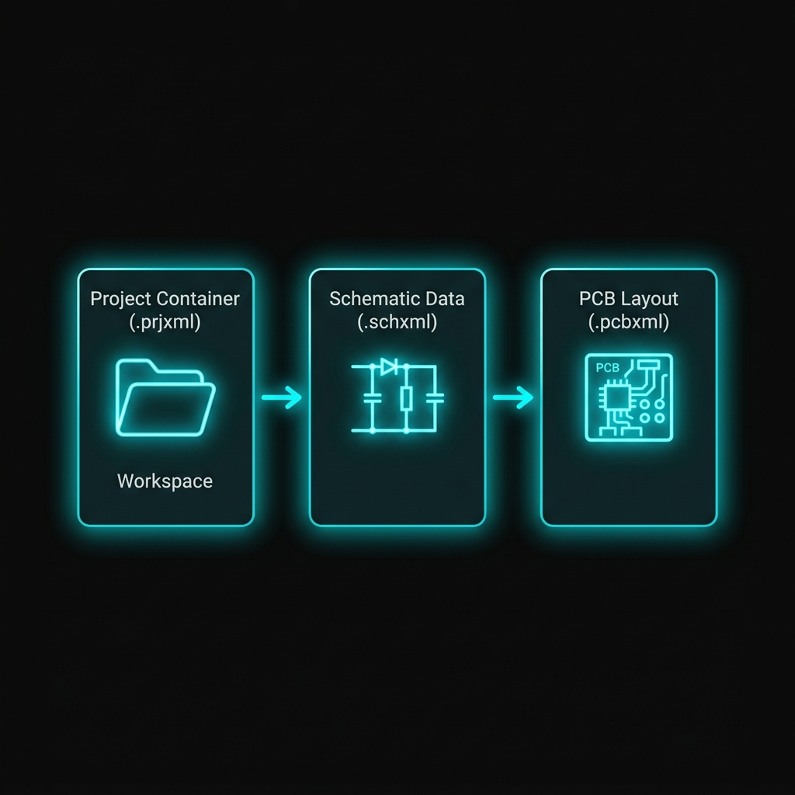

# Projects and Files

Use a WireFrame project to keep schematics, PCB documents, and project libraries together. A project can contain multiple schematics and PCBs, while a standalone document can be opened without joining a project.

## Create a project

1. Select **File → New → New Project (.prjxml)**.
2. Choose the parent folder.
3. Enter the project name in the creation dialog.
4. Select **Create**.

Keep the project and its documents in a dedicated folder. This makes relative library and model paths easier to move, archive, and share.

### Short video — Create a new project

!!! note "Video production brief"
    1. **Prepare:** Create an empty neutral destination folder and choose a fictional project name.
    2. **Opening shot (1–2 s):** Start on the workspace with **File** closed and **Project Structure** visible.
    3. **Action shot (5–8 s):** Open **File → New → New Project (.prjxml)**, choose the folder, enter the name, and confirm creation.
    4. **Result shot (2–3 s):** Hold on the new project in **Project Structure** with its name readable.
    5. **Deliver:** Export a **10–15 second** 1080p MP4; replace any clip using older menu labels.

## Open a project or document

| What you want to open | Command |
|---|---|
| WireFrame project | **File → Open Project (.prjxml)** |
| Project, schematic, or PCB | **File → Open File** |
| KiCad project | **File → Import → KiCad Project (.kicad_pro, .pro)** |

Opening a `.prjxml` restores its linked documents and project structure. Opening a `.schxml` or `.pcbxml` directly adds it as a standalone file for the current session.

### Image — Project Structure with multiple documents

!!! note "Image capture brief"
    1. **Prepare:** Compare the existing asset with the current release UI and list every changed label or control before recapturing.
    2. **Build the frame:** Capture the current **Project Structure** panel with one project, at least two schematics, and one PCB. Replace the existing image if the icons, tree labels, or panel styling are from an older build. Suggested size: **420 × 720 px**.
    3. **Clean the frame:** Close unrelated panels and tooltips, move the pointer away from key text, and hide credentials, usernames, customer data, and private paths.
    4. **Capture and finish:** Capture a native-resolution PNG, crop without cutting titles or primary actions, and add at most three subtle callouts without altering engineering content.
    5. **Approve:** Check the image at 100% zoom for current labels, readable evidence, correct release branding, and absence of sensitive information.

## Add and organize documents

Use the **Project Structure** panel to add a new or existing schematic or PCB to the active project. Save a newly created document before relying on it as a project member.

**File → New → New Schematic (.schxml)** and **New PCB (.pcbxml)** create a document directly. **File → Close Document** closes the active document; **File → Close Project** closes the project without deleting any of its files.

| Document | Extension | Contains |
|---|---|---|
| Project | `.prjxml` | Linked schematics, PCBs, and library references |
| Schematic | `.schxml` | Symbols, wires, labels, annotations, and page settings |
| PCB | `.pcbxml` | Footprints, nets, traces, vias, zones, layers, and design rules |

Use **File → Save** for the active document and **File → Save As** when you need a new path. Closing a project does not delete its documents.

## Update a schematic to PCB

Before updating a PCB:

1. Complete the schematic connectivity.
2. Assign a valid footprint to every physical component.
3. Run ERC and resolve critical issues.
4. Select **Tools → Update Schematic to PCB**.
5. Choose the target PCB when the project has more than one.
6. Review new or changed footprints and the ratsnest before routing.

!!! warning "Footprints are required"
    A physical component without a valid footprint cannot be placed correctly on the PCB. Resolve missing symbols, footprints, and pin-count mismatches in Component Review or the library editors before continuing.

### Short video — Update schematic to PCB

!!! note "Video production brief"
    1. **Prepare:** Use a saved schematic whose symbols already have approved footprint assignments and an empty target PCB.
    2. **Opening shot (2 s):** Show the completed schematic and **Tools** menu entry.
    3. **Action shot (7–10 s):** Select **Tools → Update Schematic to PCB**, choose the target when prompted, and confirm the update.
    4. **Result shot (4–5 s):** Hold on the opened PCB with transferred footprints and ratsnest visible.
    5. **Deliver:** Export a **15–20 second** 1080p MP4; do not call the command “Convert to PCB.”

## Import a KiCad project

1. Select **File → Import → KiCad Project (.kicad_pro, .pro)**.
2. Select the KiCad project file.
3. Keep WireFrame open while the progress overlay reports each import stage.
4. Review the resulting project, schematics, PCB, and library assignments.
5. Save the converted WireFrame documents.

After import, check:

- sheet and document count;
- symbol values and references;
- net labels, power symbols, and connectivity;
- footprint side, rotation, and pad numbering;
- board outline, zones, vias, and design rules;
- library and 3D model paths.

### Short video — Import a KiCad project

!!! note "Video production brief"
    1. **Prepare:** Use a small public KiCad project from a neutral path and close unrelated projects.
    2. **Opening shot (1–2 s):** Start with **File → Import → KiCad Project** visible.
    3. **Action shot (8–14 s):** Choose the project, show at least two genuine asynchronous progress stages, and cut only the inactive portion of the import.
    4. **Result shot (4–6 s):** Hold on the imported **Project Structure**, then open one schematic or PCB document.
    5. **Deliver:** Export a **15–25 second** 1080p MP4; replace any clip that omits the progress overlay.

## Import scope and removed legacy guidance

The current project importer supports KiCad `.kicad_pro` and legacy `.pro` project files. Older guideline sections claiming **File → Import → Altium Project** or **Eagle Project** have been removed because those commands are not present in the current application.

Altium library files remain supported through **View → Local Library Manager**. See [Library Import and Management](libraries/library-converter.md).

## Import a PCB outline

With a PCB active, select **File → Import → CAD Outline (.svg / .dxf)...** and tick **Import as BOARD OUTLINE** to make the drawing the board's shape — outline, cutouts, and mounting holes. The dialog shows the board size and any problems before you import. See [Board Shape and Outline](pcb/board-outline.md).

!!! note
    DXF files are read only with **Import as BOARD OUTLINE** ticked. Plain graphics import (Edge.Cuts, silk, copper) reads SVG.

## Session restoration

WireFrame remembers open projects, standalone documents, panel layout, and recent folders. On the next launch, confirm that restored documents still resolve their linked libraries and models.

If the previous session should not be restored, close its documents and project before exiting or reset the saved layout/session from Preferences.

## See also

- [Getting Started](getting-started.md)
- [Configuration and Session Storage](reference/config-and-session.md)
- [File Formats](reference/file-formats.md)
- [Library Import and Management](libraries/library-converter.md)
