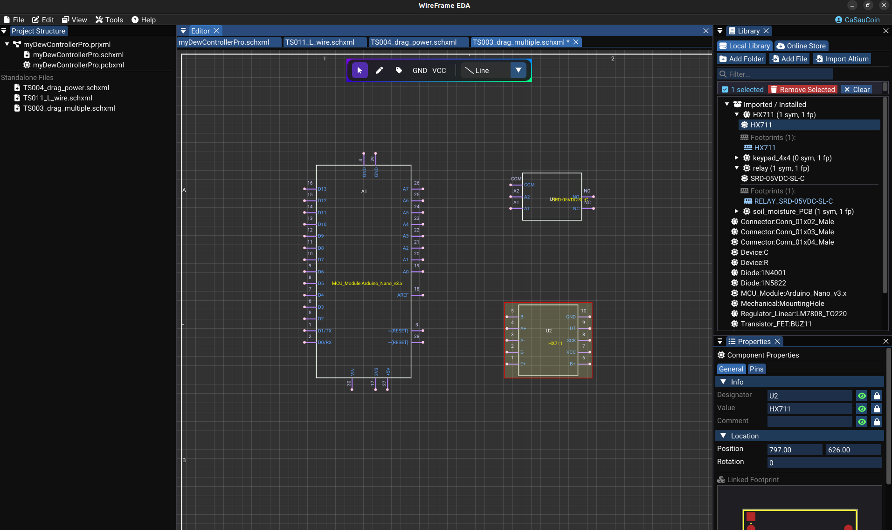

# Schematic Editor Overview

The schematic editor is the starting point for circuit design in WireFrame EDA. Use it to place components, draw wires, label nets, and annotate your design before converting to a PCB layout.

---

## What You Can Do

| Task | Tool / Feature |
|---|---|
| Place components from libraries | Library panel + double-click |
| Wire components together | Wire tool |
| Add net labels (SDA, SCL, etc.) | Label tool |
| Add power symbols (GND, VCC) | GND / VCC toolbar buttons |
| Draw annotations and borders | Line, Rectangle, Circle, Arc, Polygon, Text tools |
| Edit component properties | Properties panel |
| Manage nets and connectivity | Automatic netlist builder |

---

## Schematic Workspace

The workspace consists of:

- **Canvas** — dot grid with a page outline (A4 by default). All components, wires, and graphics are placed here.
- **Schematic toolbar** — floating at the top of the canvas with tool buttons.
- **Library panel** — lists loaded symbol libraries for component placement.
- **Properties panel** — edits properties of the selected item or page settings.

<!-- TODO: Replace with actual screenshot
     Capture a mid-complexity schematic showing:
     - _5–8 placed components (resistors, capacitors, an IC, a connector) connected by wires._
     - _Net labels visible on signal lines (e.g., "SDA", "SCL", "RESET")._
     - _GND and VCC symbols connected to power pins._
     - _The schematic floating toolbar visible at the top of the canvas._
     - _The page outline (A4) and title block border visible at the edges._
     - _A few drawing annotations (text note, rectangular border) visible._
     This screenshot gives the reader a realistic impression of a working schematic. Suggested size: 1280×720px.
-->

---

## Schematic Toolbar Modes

Each toolbar button activates a **drawing mode**. The current mode determines how mouse events are interpreted:

| Mode | Tool button | Behavior |
|---|---|---|
| `Select` | :material-cursor-default: Arrow | Click to select, drag to move, box-select |
| `Wire` | :material-vector-polyline: Wire | Click pin/canvas → add vertices → end wire |
| `Label` | :material-label: Label | Click to place a net label component |
| `Text` | :material-format-text: Text | Click to place text annotation |
| `Line` | :material-vector-line: Line | Click start → drag → release for a line |
| `Rectangle` | :material-rectangle-outline: Rect | Click corner → drag to opposite corner |
| `Circle` | :material-circle-outline: Circle | Click center → drag to set radius |
| `Arc` | :material-vector-curve: Arc | Click to define arc points |
| `Polygon` | :material-pentagon-outline: Polygon | Click vertices → right-click to finish |
| `Junction` | :material-circle-small: Dot | Click to place junction dots manually |
| `Harness` | :material-transit-connection-variant: Harness | Draw bundled net graphics |
| `PlacingGND` | :material-arrow-down-bold: GND | Click to place a GND power symbol |
| `PlacingVCC` | :material-arrow-up-bold: VCC | Click to place a VCC power symbol |

The **active tool** is highlighted with a cyan background. Press ++esc++ to return to Select mode.

---

## Interaction Model

The schematic interaction is managed by an internal interaction system that operates as a state machine:

### States

| State | Trigger |
|---|---|
| None | Default — waiting for user input |
| MovingSelection | Click+drag on selected items |
| DrawingSelectionBox | Click+drag on empty canvas |
| DrawingWire | Wire tool active, vertices being placed |
| DraggingWireVertex | Dragging a single wire vertex |
| DraggingWireSegment | Dragging a wire segment (adds vertices) |
| MovingAttribute | Dragging a text attribute (designator/value) |
| DrawingPrimitiveShape | Line/Rect/Circle/Arc/Polygon tool active |
| ResizingGraphicObject | Dragging a resize handle on a selected graphic |

### Common interactions

| Action | Input |
|---|---|
| Select a component | Left-click on it |
| Select multiple items | Drag a selection box on empty area |
| Move selected items | Click+drag selected items |
| Open context menu | Right-click on any object |
| Cancel current operation | ++esc++ or right-click |
| Delete selected | ++delete++ or ++backspace++ |
| Undo / Redo | ++ctrl+z++ / ++ctrl+y++ |

<!-- TODO: Replace with actual video
     Record a 30-second screen capture demonstrating:
     1. _Clicking a component to select it (highlight appears)._
     2. _Dragging a selection box over multiple components._
     3. _Moving the selection as a group (wires following)._
     4. _Right-clicking to show a context menu._
     5. _Pressing Undo to reverse the move._
     Resolution: 1280×720 at 30fps. Keep actions slow and deliberate.
-->
<video controls width="100%">
  <source src="../img/schematic/interaction-demo.mp4" type="video/mp4">
  Your browser does not support the video tag.
</video>

---

## Section Pages

Continue to the detailed guides for each aspect of schematic design:

| Page | What you'll learn |
|---|---|
| [Placing Components](placing-components.md) | Load libraries, place symbols, edit designators, rotate and move |
| [Wiring & Nets](wiring-and-nets.md) | Draw wires, connect pins, manage nets and labels |
| [Properties & Attributes](properties-and-attributes.md) | Edit page settings, component attributes, text formatting |
| [Graphics & Annotations](graphics-and-annotations.md) | Draw lines, rectangles, text and other annotations |
