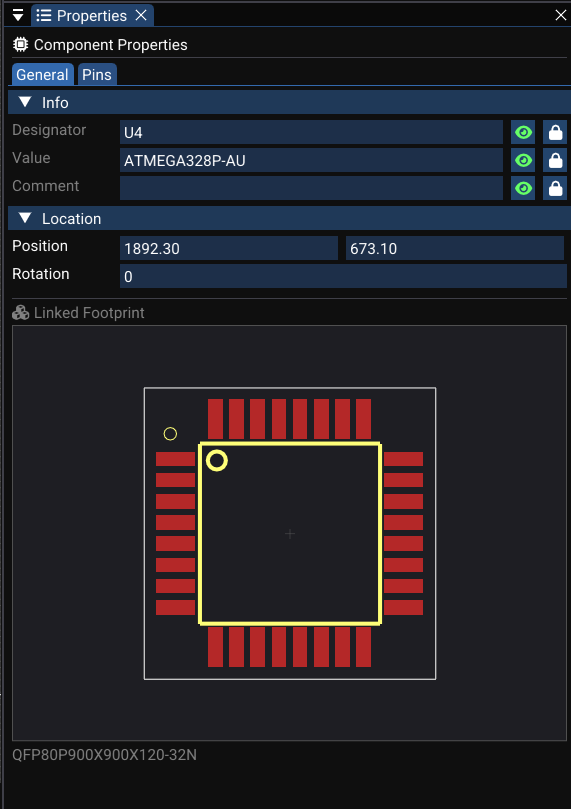

# Placing Components (Symbols)

Components in the schematic are instances of library symbols. This page covers loading libraries, placing symbols, editing properties, and manipulating components.

---

## Loading Symbol Libraries

Before placing components, you need to load at least one symbol library:

1. Ensure a **schematic document** is active (the Library panel shows symbol mode).
2. In the **Library panel**, click **Load Symbols…**
3. Select one or more KiCad symbol files (`.kicad_sym`).
4. Libraries are parsed **asynchronously** in the background.
5. Once parsing completes, available symbol names appear in the list.

While loading:

- The panel shows a **spinner** or "Loading…" status message.
- Any parsing errors are listed in the **Logger** after completion.

<!-- TODO: Replace with actual screenshot
     Capture the Library panel during and after symbol loading:
     - _**During loading**: The panel showing a status line like "Loading: Parsing resistors.kicad_sym…" with a spinner icon._
     - _**After loading**: The panel showing a full list of symbol names (e.g., "R", "C", "LED", "MCU_STM32F103") with the search filter empty and a status line reading "Ready — 150 symbols loaded"._
     Capture both states as separate screenshots if possible. Suggested size: 280×400px each.
-->

[//]: # (![Symbol Loading]&#40;../img/schematic/symbol-loading.png&#41;)

!!! tip "Search filter"
    Use the search box at the top of the Library panel to filter symbols. Type partial names like `STM32`, `R_06`, or `LED` to narrow results quickly.

---

## Placing a Symbol from the Library

1. In the **Library panel**, type a filter to find your component.
2. **Double-click** a symbol name (e.g., `R_0603`, `MCU_STM32`, `C_0805`).
3. The schematic canvas enters **component placement mode**:
    - The symbol silhouette is attached to the mouse cursor.
    - A semi-transparent preview follows the mouse, snapping to the grid.
4. **Left-click** to place the symbol at the current grid position.
5. The component is placed and you return to **Select** mode.

Each placed symbol becomes a a placed component with:

| Property | Example | Description |
|---|---|---|
| `id` (Designator) | `R1`, `U3` | Unique identifier, auto-assigned or editable |
| `value` | `10kΩ`, `100nF` | Component value |
| `type` | `R`, `C`, `MCU` | Symbol type name |
| Footprint | `R_0603_1608Metric` | Associated PCB footprint |
| Pin list | Pin 1, Pin 2 | Pin positions, names, and numbers |

<!-- TODO: Replace with actual video
     Record a 15-second screen capture showing:
     1. _Typing "R" in the Library panel search box — the list filters to show resistor symbols._
     2. _Double-clicking "R" — a resistor symbol appears attached to the cursor._
     3. _Moving the mouse over the schematic canvas — the symbol preview follows._
     4. _Left-clicking to place the resistor on the grid._
     5. _The newly placed resistor visible with its designator "R1" shown._
     Resolution: 1280×720 at 30fps.
-->
<video controls width="100%">
  <source src="../../img/schematic/placing-component.mp4" type="video/mp4">
  Your browser does not support the video tag.
</video>

---

## Assigning / Changing Designators and Values

After placing a component, select it to edit its properties:

1. **Click** the component to select it.
2. The **Properties panel** shows editable fields:

| Field | Command used | Description |
|---|---|---|
| **Designator** | an undoable command | Unique ID (e.g., R1 → R2). Updates all references. |
| **Value** | an undoable command | Electrical value (e.g., 10kΩ, 100nF) |
| **Comment** | an undoable command | Additional notes |
| **Footprint** | Direct property edit | PCB footprint name for this component |

All changes are **undoable** — press ++ctrl+z++ to revert any property edit.

!!! info "Designator ID remapping"
    Changing a component's designator (e.g., `U1` → `U3`) automatically updates:

    - The component's ID in the component registry.
    - All wire attachments pointing to the old ID.
    - Selection sets referencing the component.

<!-- TODO: Replace with actual screenshot
     Capture the Properties panel with a resistor selected:
     - _The panel showing: **Designator** field with "R1", **Value** field with "10kΩ", **Comment** field (empty), **Footprint** field with "R_0603_1608Metric"._
     - _Rotation and position fields visible below._
     - _Text attribute controls: designator visibility toggle, font size slider._
     - _The selected resistor highlighted with a cyan outline on the canvas in the background._
     Suggested size: 350×500px.
-->

---

## Rotating Components

With one or more components selected:

- Press ++r++ (default shortcut) or use the **context menu → Rotate**.
- WireFrame:
    - Updates the component's rotation angle (90° increments by default).
    - Automatically adjusts connected wires to stay attached to the (now rotated) pin positions.

Rotation is fully **undoable and redoable**.

<!-- TODO: Replace with actual video
     Record a 10-second clip:
     1. _Select a component (e.g., an IC with multiple pins and connected wires)._
     2. _Press R to rotate it 90° — the component rotates and connected wires adjust their endpoints._
     3. _Press R again for another 90° rotation._
     4. _Press Ctrl+Z twice to undo both rotations — the component and wires return to their original positions._
     Resolution: 1280×720 at 30fps.
-->
<video controls width="100%">
  <source src="../../img/schematic/rotate-component.mp4" type="video/mp4">
  Your browser does not support the video tag.
</video>

---

## Moving Components

1. **Select** one or more components (click or box-select).
2. **Click and drag** to move them on the canvas.
3. Connected wires update in real time to maintain pin attachment.

On mouse release:

- A an undoable move command is created, capturing:
    - Initial and final positions of all moved components.
    - Initial and final wire geometries.
- **Undo** restores everything (components + wires) to the exact previous state.

<!-- TODO: Replace with actual video
     Record a 15-second clip:
     1. _Draw a selection box around 3 components (e.g., two resistors and a capacitor) with connected wires._
     2. _Drag the selection to a new position — wires bend and follow._
     3. _Release the mouse — components settle at new positions._
     4. _Press Ctrl+Z — all components and wires snap back to the original positions._
     Resolution: 1280×720 at 30fps.
-->
<video controls width="100%">
  <source src="../../img/schematic/move-components.mp4" type="video/mp4">
  Your browser does not support the video tag.
</video>

---

## Deleting Components

1. Select components (individually or via selection box).
2. Press ++delete++ or use **context menu → Delete**.
3. A Undo-supported command:
    - Removes selected components by ID.
    - Removes selected wires.
    - Stores full copies for undo.

**Undo** (++ctrl+z++) restores deleted components and wires to the schematic.

---

## Copy, Cut, Paste

The schematic supports structured clipboard operations:

| Operation | Shortcut | Behavior |
|---|---|---|
| **Copy** | ++ctrl+c++ | Copies selected components and wires with relative positions and pin attachments |
| **Cut** | ++ctrl+x++ | Copies then deletes the selection |
| **Paste** | ++ctrl+v++ | Places copies at the mouse position, reassigning component IDs and reattaching wires |

During paste:

- New component IDs are generated (e.g., R1 → R5) to avoid conflicts.
- Wire pin attachments are remapped from original to new component IDs.
- The pasted group follows the mouse until you click to place it.

See [Advanced Editing](../advanced/selection-and-editing.md) for more on selection and clipboard behavior.

---

## See Also

- [Wiring & Nets](wiring-and-nets.md) — connect your placed components.
- [Properties & Attributes](properties-and-attributes.md) — edit component and page properties in detail.
- [Symbol Libraries](../libraries/symbols-library.md) — managing and creating symbol libraries.
