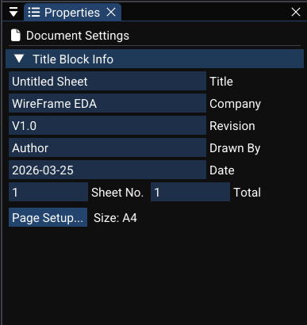
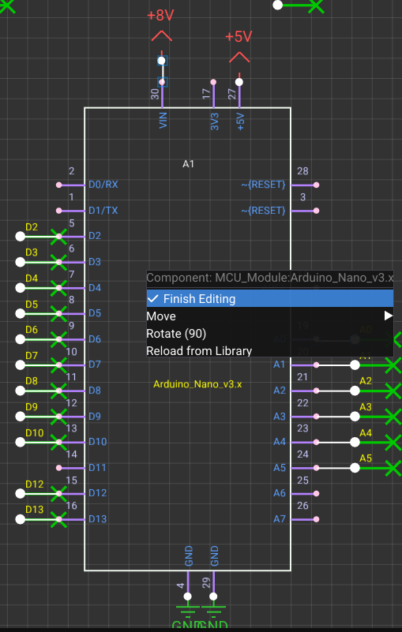

# Properties and Text Attributes

This page covers the schematic Properties panel — page settings, component attributes, wire/net properties, and text formatting controls.

---

## Sheet and Page Settings

When **nothing is selected**, the Properties panel shows page-level settings for the active `SchematicDocument`:

| Field | Description | Example |
|---|---|---|
| Paper size | A4, A3, A2, or Custom dimensions | A4 |
| Title | Design title shown in the title block | "Power Supply Rev B" |
| Company | Company or author name | "WireFrame Labs" |
| Revision | Revision identifier | "1.2" |
| Date | Design date | "2026-03-23" |
| Drawn by | Author name | "John Doe" |
| Sheet number | Current sheet number / total sheets | "1 / 3" |
| Filename | Document filename | "power.schxml" |
| Border color | Color of the page border and title block | Cyan / White |

These fields are editable directly in the Properties panel. Changes are reflected immediately on the schematic canvas (title block and page border).

<!-- TODO: Replace with actual screenshot
     Capture the Properties panel showing page settings:
     - _All fields listed above visible in the panel — Title, Company, Revision, Date, Drawn by, Sheet number._
     - _A "Paper Size" dropdown showing "A4" selected._
     - _The schematic canvas visible in the background showing the **title block** in the bottom-right corner of the page, filled with the values from the properties._
     - _Border color picker or color swatch visible._
     Suggested size: 400×500px (panel) or 1280×720px (full window with canvas showing title block).
-->

---

## Component Attributes

When a **single component** is selected, the Properties panel shows its logical fields and text attributes:

### Logical fields

| Field | Command | Description |
|---|---|---|
| **Designator** (`id`) | an undoable command | Unique component ID (e.g., R1, U3) |
| **Value** | an undoable command | Electrical value (e.g., 10kΩ) |
| **Comment** | an undoable command | Free-text notes |
| **Type** | Read-only | Symbol type from library |
| **Footprint** | Direct edit | PCB footprint name |

### Text attributes

Each component carries visual text attributes that control how text appears on the canvas:

| Attribute | Properties | Description |
|---|---|---|
| `designatorAttribute` | position, rotation, fontSize, isVisible | Controls the "R1" text display |
| `valueAttribute` | position, rotation, fontSize, isVisible | Controls the "10kΩ" text display |
| Pin name attributes | per-pin text rendering | Pin name labels on each pin |
| Pin number attributes | per-pin text rendering | Pin number labels on each pin |

Each text attribute stores:

- `content` — the displayed string.
- `relativePosition` — offset from the component origin.
- `rotation` — angle in degrees.
- `fontSize` — text size.
- `isVisible` — whether the text is drawn.

Editing these uses an undoable command (for content/position/size) and an undoable command (for rotation).

<!-- TODO: Replace with actual screenshot
     Capture a component with its text attributes visible and the Properties panel open:
     - _A resistor selected on the canvas, with "R1" (designator) displayed above and "10kΩ" (value) displayed below._
     - _The Properties panel showing all fields: Designator, Value, Comment, Footprint._
     - _Below the fields: text attribute controls — a "Designator visible" checkbox (checked), a font size slider, a rotation field._
     - _Similar controls for the Value text attribute._
     Suggested size: 800×500px (showing both canvas and panel).
-->
<video controls width="100%">
  <source src="../../img/schematic/component-attributes.mp4" type="video/mp4">
  Your browser does not support the video tag.
</video>

---

## Aligning Attributes

For designs with many components, attribute alignment keeps the schematic clean:

- The selection system tracks attribute references for selected text attributes.
- Alignment functions arrange text uniformly:

| Alignment | Description |
|---|---|
| **Align horizontally** | All selected attribute texts aligned to the same Y coordinate |
| **Align vertically** | All selected attribute texts aligned to the same X coordinate |

From the UI:

- Use context menu commands like **"Align Text Horizontally"** / **"Align Text Vertically"**.
- Or use keyboard shortcuts if configured (see [Shortcuts](../advanced/shortcuts.md)).

<!-- TODO: Replace with actual screenshot
     Capture a group of 4–5 resistors arranged vertically:
     - _**Before alignment**: Designators (R1, R2, R3, R4, R5) at slightly different horizontal positions._
     - _**After alignment**: All designators perfectly aligned in a column, all values aligned in another column._
     - _Show both states side by side or as a before/after comparison._
     Suggested size: 600×350px.
-->

---

## Wire and Net Properties

When a **wire or net label** is selected, the Properties panel shows:

| Field | Editable | Description |
|---|---|---|
| Net name | Yes | The net name for this wire/label (an undoable command) |
| Connected pins | Read-only | List of component pins on this net |
| Net classification | Future | Net class assignment for PCB design rules |

Renaming a net label updates:

- The component **value/text** for `NetLabel` components.
- The underlying **net name** in the schematic netlist.
- All other labels and wires on the same net are updated automatically.

---

## Selection-Dependent Content

The Properties panel dynamically switches its content based on what is selected:

| Selection state | Panel content |
|---|---|
| **No selection** | Page/sheet settings (paper size, title block) |
| **Single component** | Component fields + text attributes |
| **Multiple components** | Multi-edit fields (where applicable) or disabled fields |
| **Net label** | Net name editing, position |
| **Wire** | Net name, connected pins list |
| **Graphic object** | Position, size, color, line width, layer |

<!-- TODO: Replace with actual video
     Record a 20-second screen capture showing:
     1. _Click on the schematic background (no selection) — Properties panel shows page settings._
     2. _Click on a resistor — panel switches to show Designator, Value, Comment, Footprint fields._
     3. _Click on a net label — panel switches to show net name field._
     4. _Click on a graphic rectangle — panel switches to show position, size, color, line width._
     5. _Each transition should be clearly visible with the panel content changing smoothly._
     Resolution: 1280×720 at 30fps.
-->
<video controls width="100%">
  <source src="../../img/schematic/properties-switching.webm" type="video/webm">
  <source src="../../img/schematic/properties-switching.mp4" type="video/mp4">
  Your browser does not support the video tag.
</video>

---

## See Also

- [Placing Components](placing-components.md) — place and edit components.
- [Wiring & Nets](wiring-and-nets.md) — manage wires and net names.
- [Graphics & Annotations](graphics-and-annotations.md) — drawing primitives and text.
