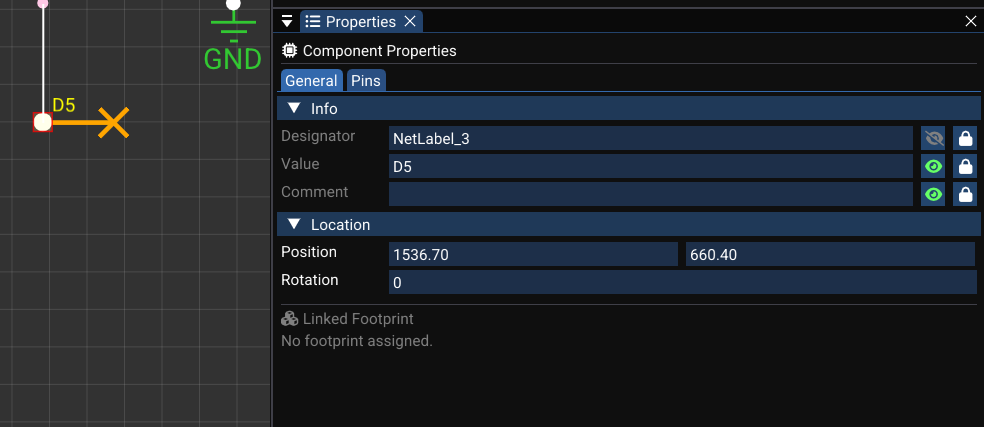

# Wiring and Nets

Wiring connects component pins into electrical nets. This page covers wire drawing, pin attachment, net labels, power symbols, and netlist management.

---

## Wire Drawing Mode

Select the **Wire** tool from the schematic toolbar (or press ++w++).

### Drawing a wire

1. **Click** on a component pin tip (or any point on the canvas) to start a wire.
2. A temporary wire follows the mouse — wires are drawn **orthogonally** (horizontal/vertical segments).
3. **Left-click** to add each vertex (corner point).
4. **Right-click** or press ++esc++ to end the current wire.

| Action | Input |
|---|---|
| Start wire | Click on pin or canvas |
| Add vertex | Left-click |
| End wire | Right-click or ++esc++ |
| Cancel wire | ++esc++ (before first vertex) |

When starting from a pin:

- WireFrame snaps the first vertex to the pin tip in world coordinates.
- The first vertex is automatically attached to that pin internally.

<!-- TODO: Replace with actual video
     Record a 20-second screen capture showing:
     1. _Press W to activate the Wire tool (toolbar button highlights)._
     2. _Click on Pin 1 of a resistor — a wire starts from the pin tip._
     3. _Move the mouse — the wire follows orthogonally with a right-angle preview._
     4. _Click to add a vertex (corner)._
     5. _Click on Pin 1 of another resistor — the wire terminates and attaches to the destination pin._
     6. _A junction dot appears if the wire intersects an existing wire._
     Resolution: 1280×720 at 30fps.
-->
<video controls width="100%">
  <source src="../../img/schematic/wire-drawing.webm" type="video/webm">
  <source src="../../img/schematic/wire-drawing.mp4" type="video/mp4">
  Your browser does not support the video tag.
</video>


---

## Connecting to Pins and Existing Wires

When you click to finish a wire on:

### Another pin

- The final vertex **snaps** to the pin tip position.
- `pinAttachments` records the component ID and pin number for both endpoints.
- The two pins are now on the same net.

### An existing wire vertex or segment

- The new wire shares that vertex position.
- WireFrame visually merges them at the connection point.
- WireFrame treats them as a **single net** — all connected wires and pins belong to the same net.

<!-- TODO: Replace with actual screenshot
     Capture a schematic area showing wire connections:
     - _A wire running from Pin 1 of component R1 to Pin 3 of component U1 — both endpoints visually touching the pin tips._
     - _A second wire branching from the middle of the first wire to another component — a **junction dot** (filled circle) visible at the branch point._
     - _A third wire connecting two pins that are close together, showing clean orthogonal routing._
     - _Zoom in enough to see the pin tips and junction clearly._
     Suggested size: 600×400px.
-->

[//]: # (![Wire Attachment]&#40;../img/schematic/wire-attachment.png&#41;)


---

## Wire Geometry and Editing

Each `Wire` stores:

| Property | Type | Description |
|---|---|---|
| `id` | String | Unique wire ID |
| `points` | List of coordinates | Ordered vertices in world coordinates |
| `pinAttachments` | Map (index → pin) | Which vertices attach to which component pins |
| `netName` | String (optional) | Explicit net name (from labels) |

### Editing operations

| Operation | How | Command |
|---|---|---|
| **Move vertex** | Drag a wire vertex (small hit radius) | Undo-supported command |
| **Drag segment** | Click and drag a segment between vertices | Inserts two new vertices, allows orthogonal adjustment |
| **Simplify** | Automatic | auto-simplification removes collinear redundant vertices |
| **Delete wire** | Select + ++delete++ | Undo-supported command |

!!! info "Wire auto-simplification"
    After dragging a segment, auto-simplification automatically removes unnecessary vertices that are collinear, keeping the wire geometry clean.

<!-- TODO: Replace with actual video
     Record a 15-second clip:
     1. _Drag a single wire vertex to a new position — the adjacent segments adjust._
     2. _Drag a wire segment (between two vertices) — two new vertices are created and the segment moves orthogonally._
     3. _Release the mouse — redundant vertices are removed automatically._
     4. _Undo to restore the original wire shape._
     Resolution: 1280×720 at 30fps.
-->

[//]: # (<video controls width="100%">)

[//]: # (  <source src="../../img/schematic/wire-editing.webm" type="video/webm">)

[//]: # (  <source src="../../img/schematic/wire-editing.mp4" type="video/mp4">)

[//]: # (  Your browser does not support the video tag.)

[//]: # (</video>)


---

## Junctions

Junction dots indicate where **three or more** wire connections meet at a single point:

- WireFrame automatically counts wire vertex and pin occurrences at each position.
- If a point has **connectivity ≥ 3**, a filled junction circle is drawn.
- You can also manually place junction dots using the **Junction** tool.

Without a junction, two crossing wires are treated as **not connected** (they simply overlap visually).

---

## Net Labels and Power Symbols

### Net labels

1. Press ++l++ or select the **Label** tool.
2. Click on the canvas to place a `NetLabel` component.
3. Edit its **Value** in the Properties panel (e.g., `SDA`, `SCL`, `+5V`, `RESET`).
4. All wires connected to that label's pin share the **same net name**.

### Power symbols

| Symbol | Toolbar mode | Description |
|---|---|---|
| **GND** | `PlacingGND` (press ++g++) | Ground reference — single-pin component |
| **VCC** | `PlacingVCC` | Positive power rail — single-pin component |
| **VDD** | Via library | Additional power symbols available in `Component_Library` |

Power symbols are simplified components with a single pin at the origin. They implicitly assign net names to connected wires.

!!! tip "Consistent naming"
    Use the same label value everywhere a net should be connected. For example, all `+3V3` labels will merge into a single net, even if they are on different parts of the schematic sheet.

<!-- TODO: Replace with actual screenshot
     Capture a schematic section showing net naming:
     - _Two or three **net labels** placed on different wires, all showing the same name (e.g., "+3V3") — indicating they belong to the same net._
     - _A **GND** symbol connected to the bottom of a capacitor._
     - _A **VCC** symbol connected to the top of a voltage regulator._
     - _All net names visible as text next to the label symbols._
     - _If possible, show the same net name appearing in two separate locations on the schematic to demonstrate connectivity across distance._
     Suggested size: 700×400px.
-->



---

## Schematic Netlist

WireFrame constructs a net graph from all wires, pins, and labels:

### Algorithm

1. Group all wires that share vertices into **clusters**.
2. Collect all pins attached to each cluster.
3. Determine net name by priority:
    1. **Net labels** and power symbols with user-defined values (highest priority).
    2. **Pin-based default names** (e.g., `Net_U1_1`).
    3. **Generic wire-based names** (e.g., `Net_Wire_42`) as fallback.

### Result

The netlist produces a map:

```
netName → SchNet { name, set<PinRef(componentId, pinNumber)> }
```

This netlist is used for:

- **Net highlighting** on the schematic canvas.
- **PCB netlist generation** during schematic-to-PCB conversion.
- **DRC consistency checks** between schematic and PCB.

---

## Net Highlighting

When you select a net label or a wire:

- WireFrame draws all wires, pins, and labels on that net in a **distinct highlight color**.
- This helps you trace connectivity across complex schematics.

<!-- TODO: Replace with actual video
     Record a 10-second clip:
     1. _Click on a net label (e.g., "SDA") on the schematic._
     2. _All wires connected to the SDA net light up with a bright highlight color (e.g., yellow or orange overlay)._
     3. _Pins on the SDA net also show the highlight._
     4. _Click on empty space to deselect — the highlight fades._
     Resolution: 1280×720 at 30fps.
-->
<video controls width="100%">
  <source src="../../img/schematic/net-highlight.webm" type="video/webm">
  <source src="../../img/schematic/net-highlight.mp4" type="video/mp4">
  Your browser does not support the video tag.
</video>


---

## See Also

- [Placing Components](placing-components.md) — place the symbols that wires connect.
- [Properties & Attributes](properties-and-attributes.md) — edit net names and component values.
- [PCB Editor](../pcb/index.md) — the netlist generated here drives PCB routing.
