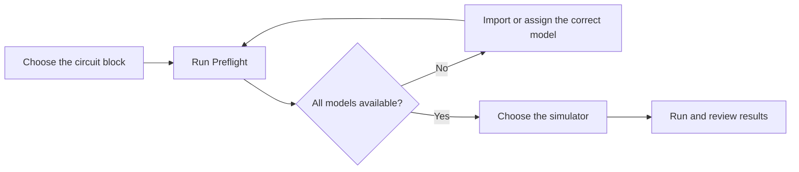

# Simulation Engines and Models

WireFrame includes a simulator for everyday use. You can also connect another supported simulator when a project or model requires it.

## Choose a simulator

Open **Simulation → SPICE Simulation Panel**, then go to **Setup → Engine**.

| Simulator | When to choose it |
|---|---|
| **ngspice** | Recommended for most projects; included with WireFrame |
| **ngspice (CLI)** | Use an ngspice installation already available on your computer |
| **Xyce** | Use when your project has been prepared and validated for Xyce |
| **LTspice** | Use when you need to compare with an LTspice-compatible model or workflow |

Unavailable simulators remain visible and show why they cannot be used.

## Connect an external simulator

1. Install the simulator using its official installer or package.
2. Open **Preferences → Simulation**.
3. Find the simulator under **Engines**.
4. Click **Browse…** and select its executable file.
5. Confirm that its status changes to **found**.
6. Return to the Simulation Workbench and select it under **Setup → Engine**.

Use **Clear** to remove a custom location and let WireFrame search the normal system locations again.

## Set your simulation defaults

Under **Preferences → Simulation**, you can choose:

- the default analysis;
- the default transient duration;
- the default time step;
- executable locations for optional simulators.

These choices are restored the next time WireFrame starts.

## Resolve a missing model

Some components—especially integrated circuits and transistors—need a simulation model from the manufacturer.

1. Open the workbench **Models** tab.
2. Find the item marked **Missing**.
3. Note the component designator and requested model name.
4. Download the correct SPICE model from the component manufacturer.
5. Import the model and assign it to the component.
6. Run **Preflight** again.

!!! warning "Match the exact component"
    A model for a similar part can produce convincing but incorrect results. Confirm the manufacturer part number, model name, pin order, and package against the datasheet.

## Before running

## Troubleshooting

| What you see | What to check |
|---|---|
| **Not installed** | Select the correct executable in **Preferences → Simulation** |
| **Run** is disabled | Run Preflight and read the readiness message |
| A model is missing | Confirm the component's assigned model and datasheet |
| No waveform appears | Select a signal, check the analysis, then review the simulation log |
| Two simulators disagree | Confirm both runs use the same sources, loads, model version, and settings |
