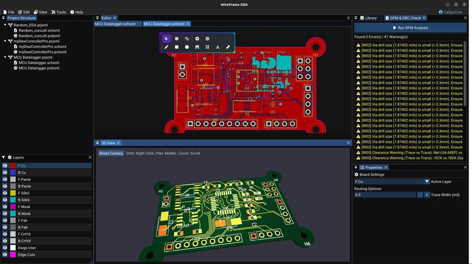

# User Interface Overview

WireFrame uses dockable panels around the active schematic or PCB editor. Available tools and panels change with the active document type.

## Main menus

### File

Use **File** to:

- create a project, schematic, or PCB;
- open a WireFrame file or project;
- import a KiCad project or SVG board outline;
- save the active document;
- export schematic PDF, PCB PDF, or fabrication outputs;
- edit schematic page settings;
- close the document or project.

Commands that do not apply to the active document are disabled.

### Edit

Use **Edit** for undo, redo, clipboard actions, selection operations, and other edits supported by the active editor. Prefer the displayed shortcut because key bindings can be customized.

### View

Use **View** to show or hide:

- Project Structure;
- Editor Panel;
- Component Library;
- Properties;
- Local Library Manager;
- AI Copilot Chat;
- PCB Layers;
- Zone Manager;
- Design Rules.

### Tools

Use **Tools** for the Symbol Library Editor, PCB Footprint Editor, schematic wiring assistance, **Update Schematic to PCB**, ERC, DFM/DRC, Fabrication Output, and Gerber Viewer. Availability depends on the active document.

### Simulation

Use **Simulation** for the **SPICE Simulation Panel**, **Pre-flight Validation Checklist**, and **SPICE Model Editor**.

### Preferences

Open the Preferences dialog to configure application, panel, grid, simulation, AI, and update settings. Use **Reset to Default Layout** only when you intend to discard the saved docking layout.

### Help and account

Use the Help menu for documentation, downloads, feedback, updates, and About. The account area shows sign-in or subscription state and provides saved-login controls.

## Docking layout

Drag a panel by its title to dock it to another edge or tab group. Preferences can enable detachable multi-monitor panels and companion-panel behavior.

### Short video — Rearrange and restore panels

!!! note "Video production brief"
    1. **Prepare:** Reset to a known layout and choose one panel that can be moved without covering the design.
    2. **Opening shot (1–2 s):** Hold on the original docked layout with panel titles readable.
    3. **Action shot (6–10 s):** Move and dock the panel, demonstrate the detachable state when available, then invoke the current saved/default layout restore action.
    4. **Result shot (3–4 s):** Hold on the restored layout matching the opening state.
    5. **Deliver:** Export a **12–18 second** 1080p MP4 and replace media with obsolete **View** or **Preferences** labels.

## Project Structure

The Project Structure panel lists the active project and linked schematics and PCBs. Use it to open documents and manage project membership. Standalone files appear separately from project-owned documents.

### Image — Current Project Structure

!!! note "Image capture brief"
    1. **Prepare:** Compare the existing asset with the current release UI and list every changed label or control before recapturing.
    2. **Build the frame:** Capture a current project tree with multiple schematics and one PCB. Replace older images if icons or group labels differ. Suggested size: **420 × 720 px**.
    3. **Clean the frame:** Close unrelated panels and tooltips, move the pointer away from key text, and hide credentials, usernames, customer data, and private paths.
    4. **Capture and finish:** Capture a native-resolution PNG, crop without cutting titles or primary actions, and add at most three subtle callouts without altering engineering content.
    5. **Approve:** Check the image at 100% zoom for current labels, readable evidence, correct release branding, and absence of sensitive information.

## Editor panel

The center editor displays the active schematic or PCB. Common actions include:

- mouse wheel to zoom;
- middle-drag or the configured pan action to move the view;
- click or box selection;
- context menu for object-specific actions;
- shortcuts shown in the active key map.

Toolbars change when switching between schematic and PCB documents.

## Component Library

With a schematic active, the library lists symbols. With a PCB active, it lists footprints. Search before placing an item and check that the selected library item is the intended part or package.

Use **View → Local Library Manager** to add or remove persistent library sources.

## Properties

Properties follow the current selection:

- schematic components expose value, footprint, and text attributes;
- wires and labels expose connectivity-related properties;
- PCB footprints expose placement, layer, designator, and model-related properties;
- traces, vias, zones, and graphics expose type-specific settings.

When multiple objects are selected, only shared or supported batch properties may be available.

## PCB Layers

The PCB Layers panel controls active layer, visibility, and color. Hiding a layer changes the view, not the board data. Confirm the active copper layer before routing or adding vias.

## Notifications and logs

Status messages and notification overlays report saves, imports, checks, and failures. Read the full message before repeating an action. For simulation, also inspect **Last run** and the simulation log.

### Short video — Notification and status feedback

!!! note "Video production brief"
    1. **Prepare:** Choose a safe save/import action and a reproducible warning that does not modify or delete user data.
    2. **Opening shot (1 s):** Start on a clean workspace with no notification visible.
    3. **Action shot (4–6 s):** Trigger the successful action and hold its notification, then trigger the non-destructive warning after the first overlay clears.
    4. **Result shot (2–3 s):** Hold on the warning long enough to read its message and severity styling.
    5. **Deliver:** Export an **8–12 second** 1080p MP4; replace the clip if the current overlay design differs.

## Current Preferences categories

| Category | Includes |
|---|---|
| Application | Theme, units, autosave |
| Panels | Detachable panels, follow behavior, layouts and presets |
| Grid | Visibility, crosshair, snap, step, rotation, PCB defaults |
| Simulation | Engine paths, default analysis, transient defaults |
| AI | Provider key and model settings |
| About / Updates | Version, tier, update check |

Select **OK** to keep changes or **Cancel** to discard pending dialog changes.

## See also

- [Getting Started](getting-started.md)
- [Keyboard Shortcuts](advanced/shortcuts.md)
- [Configuration and Session Storage](reference/config-and-session.md)
