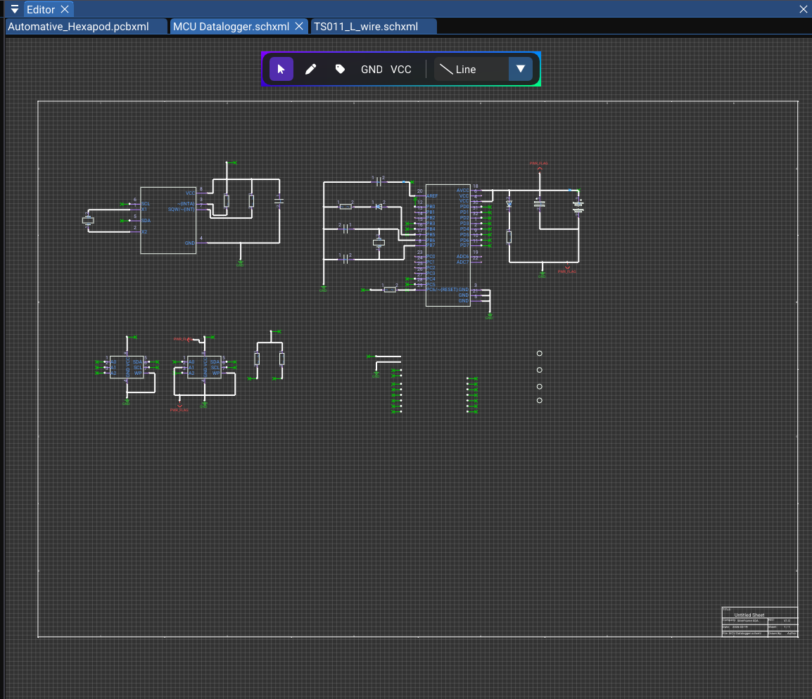
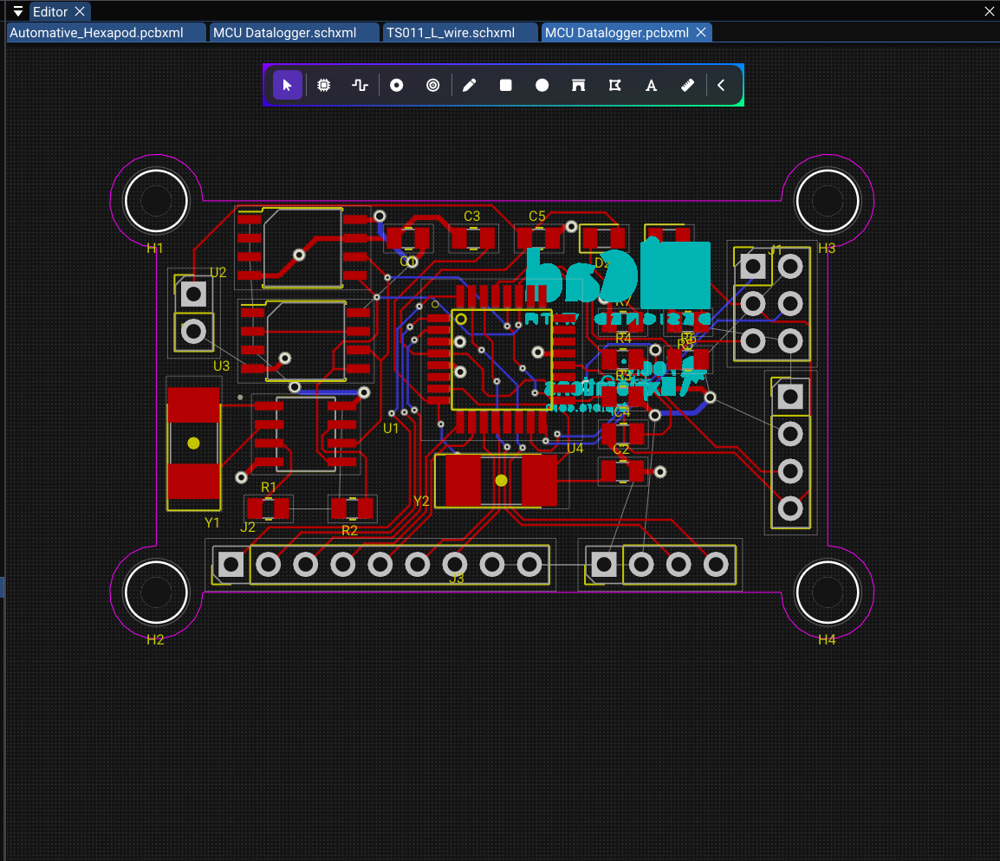
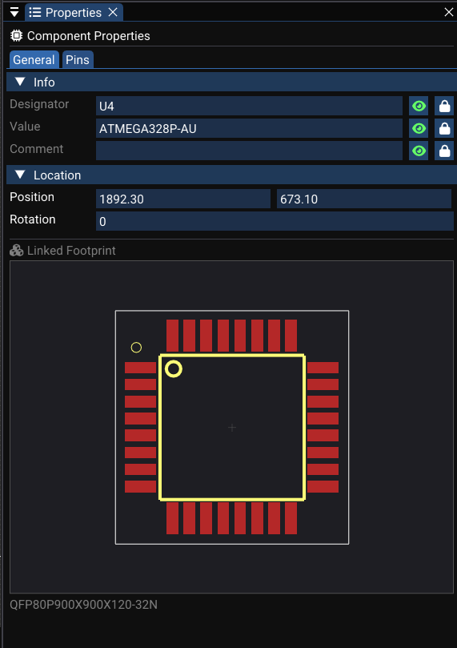
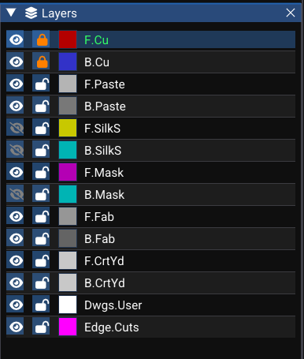

# User Interface Overview

This page provides a detailed tour of every part of the WireFrame UI. Understanding the layout will help you work efficiently as you design schematics and PCBs.

---

## Menu Bar

Located at the top of the window. Provides access to all major operations:

### File menu

| Action | Shortcut | Description |
|---|---|---|
| New Project… | | Create a new `.prjxml` project |
| Open Project… | | Open an existing project |
| Open… | ++ctrl+o++ | Open a schematic or PCB file |
| New Schematic | ++ctrl+n++ | Create a new schematic document |
| New PCB | | Create a new PCB document |
| Save | ++ctrl+s++ | Save the active document |
| Save As… | ++ctrl+shift+s++ | Save with a new filename |
| Close Project | | Close the active project |
| Export → | | Sub-menu for PDF, Gerber, BOM export |

### Edit menu

| Action | Shortcut | Description |
|---|---|---|
| Undo | ++ctrl+z++ | Undo last action |
| Redo | ++ctrl+y++ | Redo last undone action |
| Cut | ++ctrl+x++ | Cut selected items to clipboard |
| Copy | ++ctrl+c++ | Copy selected items |
| Paste | ++ctrl+v++ | Paste from clipboard |
| Delete | ++delete++ | Delete selected items |

### View menu

| Action | Description |
|---|---|
| Toggle Library | Show/hide the Library panel |
| Toggle Layers | Show/hide the Layer panel (PCB) |
| Toggle Properties | Show/hide the Properties panel |
| 3D Viewer… | Open the 3D PCB viewer |
| Fit to Screen | Zoom to fit all content |

### Tools menu

| Action | Description |
|---|---|
| Symbol Editor | Open the symbol library editor |
| Footprint Wizard | Open the footprint generator |
| Design Rules | Open design rules configuration |
| DFM Check | Run DFM/DRC checks on the active PCB |
| Gerber Viewer | Open the built-in Gerber file viewer |
| Keymap… | Open the keyboard shortcut editor |

### Help menu

| Action | Description |
|---|---|
| About | Show version and license information |
| Check for Updates | Check for newer versions (if enabled) |

---

## Docking Layout

WireFrame uses **docking layout**, giving you full control over panel arrangement:

- **Drag tabs** to move panels between docking zones (left, right, bottom, center).
- **Float panels** by dragging them outside the docking area — they become independent windows.
- **Split zones** by dropping a panel on the edge of an existing zone.
- **Layout persistence**: your arrangement is saved automatically via ImGui configuration and restored on next launch.

Common default panels:

| Panel | Default position |
|---|---|
| Project Structure | Left |
| Editor (canvas) | Center |
| Library | Right (top) |
| Properties | Right (bottom) |
| Layers (PCB only) | Right (middle) |
| Logger / Notifications | Overlay (bottom-right) |

---

## Project Structure Panel

Shows all open projects and their contents in a tree view:

- **Project node** (`.prjxml`) — the root.
    - **Schematics** — lists all `.schxml` files registered in the project.
    - **PCBs** — lists all `.pcbxml` files registered in the project.

### Interactions

| Action | How |
|---|---|
| Open a document | Click a schematic or PCB entry |
| Add new schematic/PCB | Right-click project → Add New… |
| Rename a file | Right-click → Rename |
| Remove from project | Right-click → Remove |
| Delete from disk | Right-click → Delete (with confirmation) |

!!! info "Standalone mode"
    You can open schematic/PCB files without a project. They appear as standalone tabs in the editor but are not linked to a project tree.

<!-- TODO: Replace with actual screenshot
     Capture the Project Structure panel showing:
     - One project ("SampleBoard.prjxml") expanded
     - Under "Schematics": two files (main.schxml, power.schxml)
     - Under "PCBs": one file (SampleBoard.pcbxml)
     - One file highlighted (currently open)
     - A right-click context menu visible (Add New, Remove, Delete)
     Crop to the panel only. 300×500px.
-->

See [Projects & Files](projects.md) for more details.

---

## Editor Panel

The central area where you design. It holds:

- **One tab per open document** (schematic or PCB).
- Tab shows the **filename** (or "Untitled-SCH-N" / "Untitled-PCB-N" for new documents).
- A **dot** or **asterisk** next to the name indicates unsaved changes.
- Right-click a tab to **Close**, **Close Others**, or **Close All**.

### Canvas behavior (common to schematic and PCB)

| Feature | Description |
|---|---|
| Grid | Dot grid for alignment; grid spacing depends on zoom level |
| Pan | Hold middle mouse button and drag |
| Zoom | Mouse scroll wheel, centered on cursor |
| Fit to screen | Press ++f++ (default) to fit all content in view |
| Zoom to selection | Press ++shift+f++ to zoom to selected items |

### Schematic canvas

Displays a page outline (A4/A3/custom), title block border, and all placed components, wires and graphics.

### PCB canvas

Displays the board area, placed footprints, traces, vias, zones and ratsnest lines.

---

## Library Panel

Context-sensitive — content changes based on the active document type:

### When a schematic is active

- Shows loaded **symbol libraries** and their symbols.
- **Search filter** at the top for quick lookup (type partial name like `STM32` or `R_`).
- **Double-click** a symbol to start placing it on the schematic canvas.
- **Right-click** for options: Unload Library, Reload, Link Footprint.

<!-- TODO: Replace with actual screenshot
     Capture the Library panel in schematic context:
     - Search box at the top with "res" typed
     - Filtered list: "R", "R_0402", "R_0603", "R_1206"
     - Status bar: "Ready — 150 symbols"
     - One symbol highlighted
     Crop to panel only. 280×400px.
-->

### When a PCB is active

- Shows loaded **footprint libraries** and their footprints.
- Same **search filter** functionality.
- **Double-click** to place a footprint on the PCB, or to assign to a selected component.
- **Right-click** for options: Unload, Reload, Open in Footprint Wizard.

<!-- TODO: Replace with actual screenshot
     Same as above but showing footprint names (SOT-23, QFP-48, R_0603_1608Metric).
     PCB editor visible in background. 280×400px.
-->

---

## Properties Panel

Displays editable information about the current selection and active document:

### Schematic properties

| Selection | Properties shown |
|---|---|
| Single component | Designator, Value, Comment, Footprint, Rotation, Position |
| Net label | Net name, Position, Font size, Visibility |
| Wire | Net name, Connected pins list |
| Graphic object | Position, Size, Color, Layer, Line width |
| No selection | Page settings (paper size, title, company, revision, date) |

### PCB properties

| Selection | Properties shown |
|---|---|
| Footprint | Reference, Value, Layer, Position, Rotation, 3D model |
| Trace | Net name, Layer, Width, Length |
| Via | Net name, Position, Diameter, Drill |
| Pad | Number, Net, Shape, Size, Drill, Layers |
| Zone | Net name, Layer, Priority, Clearance |
| No selection | Board boundary, Design rules summary |

All property edits are applied through the command system and are fully **undoable/redoable**.

<!-- TODO: Replace with actual screenshot
     Properties panel with a resistor selected:
     - Designator: R1, Value: 10kΩ, Comment: empty, Footprint: R_0603_1608Metric
     - Rotation and position fields
     - Text attribute controls (designator visibility, font size)
     - Selected resistor highlighted on schematic canvas in background
     350×500px.
-->

---

## Toolbars

### Schematic toolbar

A floating toolbar over the schematic canvas (centered at the top):

| Tool | Icon description | Mode |
|---|---|---|
| Select | Arrow cursor | Default selection and move mode |
| Wire | Angled line | Draw orthogonal wires between pins |
| Label | "A" with tag | Place net labels |
| Text | "T" | Place text annotations |
| Line | Diagonal line | Draw straight lines |
| Rectangle | Rectangle outline | Draw rectangles |
| Circle | Circle outline | Draw circles |
| Arc | Curved line | Draw arcs |
| Polygon | Pentagon | Draw polygons (multi-vertex) |
| Junction | Filled dot | Place junction dots |
| Harness | Bundled wires | Draw net harness graphics |
| GND | Ground symbol | Place GND power symbol |
| VCC | Arrow-up symbol | Place VCC power symbol |

The **active tool** is highlighted with a cyan background. Click a different tool button to change modes.

### PCB toolbar

A similar floating toolbar over the PCB canvas:

| Tool | Icon description | Mode |
|---|---|---|
| Select | Arrow cursor | Default selection and move mode |
| Place Footprint | IC package | Place a footprint from library |
| Route Trace | Trace path | Route traces between pads |
| Draw Via | Via circle | Place vias |
| Place Hole | Drill circle | Place mechanical holes |
| Draw Line | Diagonal line | Draw graphic lines |
| Draw Rect | Rectangle | Draw graphic rectangles |
| Draw Circle | Circle | Draw graphic circles |
| Draw Arc | Arc | Draw graphic arcs |
| Draw Polygon | Pentagon | Draw graphic polygons |
| Draw Text | "T" | Place text on silkscreen/fab layers |
| Measure | Ruler | Measure distances on the board |

---

## Layer Panel (PCB Only)

Displayed when a PCB document is active. Shows a table of all board layers:

| Column | Description |
|---|---|
| **Eye icon** | Toggle layer visibility (click to show/hide) |
| **Color patch** | Layer color — click to open color picker |
| **Layer name** | Click to set as the **active routing/drawing layer** |

The currently **active layer** is highlighted (e.g., F.Cu with a cyan indicator).

<!-- TODO: Replace with actual screenshot
     Layer panel showing:
     - F.Cu: eye on, red patch, highlighted as active
     - B.Cu: blue patch, visible
     - F.SilkS, B.SilkS, F.Mask, B.Mask (some hidden/greyed)
     - Edge.Cuts: magenta patch
     - 8–10 layers listed
     250×400px.
-->

---

## Notifications and Logger

The **Logger overlay** displays transient messages at the bottom-right corner of the editor:

| Severity | Icon | Color | Example |
|---|---|---|---|
| Info | :material-information: | Blue | "Project loaded successfully" |
| Success | :material-check-circle: | Green | "File saved: main.schxml" |
| Warning | :material-alert: | Yellow | "Library parsing: 2 symbols skipped" |
| Error | :material-close-circle: | Red | "Failed to save: permission denied" |

Messages auto-fade after a few seconds. They are used for:

- File I/O success or failure.
- Project operations (open, close, create).
- DFM/DRC results summary.
- Library loading progress.

<!-- TODO: Replace with actual video (MP4, 10 seconds, 1280×720 at 30fps)
     1. User saves a file → green toast appears bottom-right
     2. Toast fades after 3–4 seconds
     3. User loads invalid library → yellow warning toast appears
-->

<video controls width="100%">
  <source src="../img/ui-overview/notification-toast.webm" type="video/webm">
  <source src="../img/ui-overview/notification-toast.mp4" type="video/mp4">
  Your browser does not support the video tag.
</video>

---

## See Also

- [Projects & Files](projects.md) — how projects are structured and linked to documents.
- [Schematic Editor](schematic/index.md) — detailed guide to the schematic workspace.
- [PCB Editor](pcb/index.md) — detailed guide to the PCB workspace.
- [Keyboard Shortcuts](advanced/shortcuts.md) — full list of customizable key bindings.
